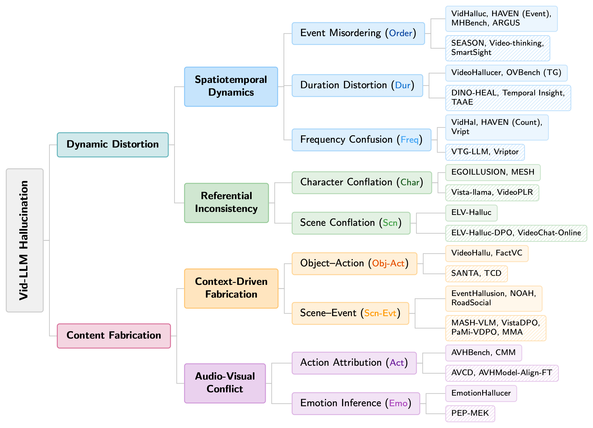

<div align="center">

# Awesome-Video-Hallucination [](https://awesome.re)

### Distorted or Fabricated? A Survey on Hallucination in Video LLMs

*Yiyang Huang<sup>1</sup>, Yitian Zhang<sup>1</sup>, Yizhou Wang<sup>1</sup>, Mingyuan Zhang<sup>1</sup>, Liang Shi<sup>1</sup>, Huimin Zeng<sup>1</sup>, Yun Fu<sup>1,2</sup>*

<sup>1</sup>Department of Electrical and Computer Engineering, Northeastern University
<br>
<sup>2</sup>Khoury College of Computer Science, Northeastern University

<br>

[](# )
[](LICENSE)
[](#evaluation-benchmarks)
[](https://github.com)

<br>


<br>

A curated and structured collection of papers on **hallucination in Video Large Language Models (Vid-LLMs)**,<br>covering **19 evaluation benchmarks** and **23 mitigation methods**.<br>
All papers are organized according to our mechanism-driven taxonomy,<br>which classifies video hallucinations into *Dynamic Distortion* and *Content Fabrication*.

</div>

---

<details>
<summary><b>Table of Contents</b></summary>

- [Taxonomy of Video Hallucinations](#taxonomy-of-video-hallucinations)
- [Evaluation Benchmarks](#evaluation-benchmarks) (19 benchmarks)
  - [Spatiotemporal Dynamics Benchmarks](#-spatiotemporal-dynamics-benchmarks-dynamic-distortion)
  - [Referential Inconsistency Benchmarks](#-referential-inconsistency-benchmarks-dynamic-distortion)
  - [Context-Driven Fabrication Benchmarks](#-context-driven-fabrication-benchmarks-content-fabrication)
  - [Audio-Visual Conflict Benchmarks](#-audio-visual-conflict-benchmarks-content-fabrication)
- [Mitigation Strategies](#mitigation-strategies) (23 methods)
  - [Spatiotemporal Dynamics Mitigation](#-spatiotemporal-dynamics-mitigation-dynamic-distortion)
  - [Referential Inconsistency Mitigation](#-referential-inconsistency-mitigation-dynamic-distortion)
  - [Context-Driven Fabrication Mitigation](#-context-driven-fabrication-mitigation-content-fabrication)
  - [Audio-Visual Conflict Mitigation](#-audio-visual-conflict-mitigation-content-fabrication)
- [Contributing](#contributing)
</details>

---

## Taxonomy of Video Hallucinations

We propose a **mechanism-driven taxonomy** that classifies hallucinations in Video Large Language Models (Vid-LLMs) into two primary types:

<table>
<tr>
<td width="50%" valign="top">

🔷 **Dynamic Distortion**

The model correctly detects entities but misrepresents their temporal progression or referential consistency.

- 🔵 *Spatiotemporal Dynamics* — Errors in event ordering, duration estimation, or frequency counting.
- 🟢 *Referential Inconsistency* — Characters or scenes are conflated across temporal boundaries.

</td>
<td width="50%" valign="top">

🔶 **Content Fabrication**

The model produces outputs that lack grounding in visual evidence and are instead influenced by learned priors.

- 🟠 *Context-Driven Fabrication* — Common object-action or scene-event associations lead to unsupported predictions.
- 🟣 *Audio-Visual Conflict* — Dominant auditory cues override visual input.

</td>
</tr>
</table>

<p align="center">
    
    <br>
    <em>Mechanism-driven taxonomy of Vid-LLM hallucinations. Solid fill = benchmarks; striped fill = mitigation methods.</em>
</p>

---

## Evaluation Benchmarks

> Benchmarks organized by our mechanism-driven taxonomy, evaluating different types of hallucinations in Vid-LLMs.

### 🔵 Spatiotemporal Dynamics Benchmarks (Dynamic Distortion)

<details open>
<summary><b>Event Misordering</b> (4 papers)</summary>

| Title  | Benchmark  | Venue  | Date  | Code  |
|:------|:---------:|:-----:|:----:|:----:|
| [**VidHalluc: Evaluating Temporal Hallucinations in Multimodal Large Language Models for Video Understanding**](https://arxiv.org/abs/2412.03735) | VidHalluc | CVPR 2025 | 12/2024 | [](https://people-robots.github.io/vidhalluc) |
| [**Exploring Hallucination of Large Multimodal Models in Video Understanding: Benchmark, Analysis and Mitigation**](https://arxiv.org/abs/2503.19622) | HAVEN | arXiv 2025 | 03/2025 | [](https://github.com/Hongcheng-Gao/HAVEN) |
| [**MHBench: Demystifying Motion Hallucination in VideoLLMs**](https://ojs.aaai.org/index.php/AAAI/article/view/32463) | MHBench | AAAI 2025 | 01/2025 | [](https://github.com/xzhouzeng/MHBench) |
| [**ARGUS: Hallucination and Omission Evaluation in Video-LLMs**](https://arxiv.org/abs/2506.07371) | ARGUS | ICCV 2025 | 06/2025 | [](https://github.com/JARVVVIS/argus) |

</details>

<details open>
<summary><b>Duration Distortion</b> (2 papers)</summary>

| Title  | Benchmark  | Venue  | Date  | Code  |
|:------|:---------:|:-----:|:----:|:----:|
| [**VideoHallucer: Evaluating Intrinsic and Extrinsic Hallucinations in Large Video-Language Models**](https://arxiv.org/abs/2406.16338) | VideoHallucer | arXiv 2024 | 06/2024 | [](https://github.com/patrick-tssn/VideoHallucer) |
| [**Online Video Understanding: OVBench and VideoChat-Online**](https://arxiv.org/abs/2501.00584) | OVBench | CVPR 2025 | 01/2025 | [](https://videochat-online.github.io/) [](https://github.com/mcg-nju/videochat-online) |

</details>

<details open>
<summary><b>Frequency Confusion</b> (2 papers)</summary>

| Title  | Benchmark  | Venue  | Date  | Code  |
|:------|:---------:|:-----:|:----:|:----:|
| [**VidHal: Benchmarking Temporal Hallucinations in Vision LLMs**](https://arxiv.org/abs/2411.16771) | VidHal | arXiv 2024 | 11/2024 | [](https://github.com/Lookuz/VidHal) |
| [**Vript: A Video Is Worth Thousands of Words**](https://arxiv.org/abs/2406.06040) | Vript | NeurIPS 2024 | 06/2024 | [](https://github.com/mutonix/Vript) |

</details>

### 🟢 Referential Inconsistency Benchmarks (Dynamic Distortion)

<details open>
<summary><b>Character Conflation</b> (2 papers)</summary>

| Title  | Benchmark  | Venue  | Date  | Code  |
|:------|:---------:|:-----:|:----:|:----:|
| [**EGOILLUSION: Benchmarking Hallucinations in Egocentric Video Understanding**](https://aclanthology.org/2025.emnlp-main.1446/) | EGOILLUSION | EMNLP 2025 | 11/2025 | [](https://sites.google.com/view/egoillusion-demo/home) |
| [**MESH: Measuring Hallucinations in Large Video Models**](https://arxiv.org/abs/2509.08538) | MESH | ACM MM 2025 | 09/2025 | [](https://github.com/HCYANG2000/MESH-Benchmark) |

</details>

<details open>
<summary><b>Scene Conflation</b> (1 paper)</summary>

| Title  | Benchmark  | Venue  | Date  | Code  |
|:------|:---------:|:-----:|:----:|:----:|
| [**ELV-Halluc: Benchmarking Semantic Aggregation Hallucinations in Long Video Understanding**](https://arxiv.org/abs/2508.21496) | ELV-Halluc | arXiv 2025 | 08/2025 | [](https://github.com/hlsv02/ELV-Halluc) |

</details>

### 🟠 Context-Driven Fabrication Benchmarks (Content Fabrication)

<details open>
<summary><b>Object-Action Hallucination</b> (2 papers)</summary>

| Title  | Benchmark  | Venue  | Date  | Code  |
|:------|:---------:|:-----:|:----:|:----:|
| [**VideoHallu: Evaluating and Mitigating Multi-modal Hallucinations on Synthetic Video Understanding**](https://arxiv.org/abs/2505.01481) | VideoHallu | NeurIPS 2025 | 05/2025 | [](https://github.com/zli12321/VideoHallu) |
| [**Models See Hallucinations: Evaluating the Factuality in Video Captioning**](https://arxiv.org/abs/2303.02961) | FactVC | EMNLP 2023 | 03/2023 | [](https://github.com/PKULiuHui/FactVC) |

</details>

<details open>
<summary><b>Scene-Event Hallucination</b> (3 papers)</summary>

| Title  | Benchmark  | Venue  | Date  | Code  |
|:------|:---------:|:-----:|:----:|:----:|
| [**EventHallusion: Diagnosing Event Hallucinations in Video LLMs**](https://arxiv.org/abs/2409.16597) | EventHallusion | arXiv 2024 | 09/2024 | [](https://github.com/Stevetich/EventHallusion) |
| [**NOAH: Benchmarking Narrative Prior driven Hallucination and Omission in Video Large Language Models**](https://arxiv.org/abs/2511.06475) | NOAH | arXiv 2025 | 11/2025 | [](https://anonymous550520.github.io/) |
| [**RoadSocial: A Diverse VideoQA Dataset and Benchmark for Road Event Understanding from Social Video Narratives**](https://openaccess.thecvf.com/content/CVPR2025/papers/Parikh_RoadSocial_A_Diverse_VideoQA_Dataset_and_Benchmark_for_Road_Event_CVPR_2025_paper.pdf) | RoadSocial | CVPR 2025 | 02/2025 | [](https://roadsocial.github.io/) [](https://github.com/roadsocial/roadsocial) |

</details>

### 🟣 Audio-Visual Conflict Benchmarks (Content Fabrication)

<details open>
<summary><b>Action Attribution</b> (2 papers)</summary>

| Title  | Benchmark  | Venue  | Date  | Code  |
|:------|:---------:|:-----:|:----:|:----:|
| [**AVHBench: A Cross-Modal Hallucination Benchmark for Audio-Visual Large Language Models**](https://arxiv.org/abs/2410.18325) | AVHBench | ICLR 2025 | 10/2024 | [](https://github.com/kaist-ami/AVHBench) |
| [**The Curse of Multi-Modalities: Evaluating Hallucinations of Large Multimodal Models across Language, Visual, and Audio**](https://arxiv.org/abs/2410.12787) | CMM | arXiv 2024 | 10/2024 | [](https://cmm-damovl.site/) [](https://github.com/DAMO-NLP-SG/CMM) |

</details>

<details open>
<summary><b>Emotion Inference</b> (1 paper)</summary>

| Title  | Benchmark  | Venue  | Date  | Code  |
|:------|:---------:|:-----:|:----:|:----:|
| [**EmotionHallucer: Evaluating Emotion Hallucinations in Multimodal Large Language Models**](https://arxiv.org/abs/2505.11405) | EmotionHallucer | arXiv 2025 | 05/2025 | [](https://github.com/xxtars/EmotionHallucer) |

</details>

<p align="right"><a href="#awesome-video-hallucination-">⬆ Back to Top</a></p>

---

## Mitigation Strategies

> Methods proposed to reduce hallucinations in Vid-LLMs, classified by the type of hallucination they target.

### 🔵 Spatiotemporal Dynamics Mitigation (Dynamic Distortion)

<details open>
<summary><b>Event Misordering</b> (3 papers)</summary>

| Title  | Method  | Venue  | Date  | Training-Free  | Code  |
|:------|:------:|:-----:|:----:|:-------------:|:----:|
| [**SEASON: Mitigating Temporal Hallucination in Video LLMs via Self-Diagnostic Contrastive Decoding**](https://arxiv.org/abs/2512.04643) | SEASON | arXiv 2025 | 12/2025 | ✔ | - |
| [**Exploring Hallucination of Large Multimodal Models in Video Understanding: Benchmark, Analysis and Mitigation**](https://arxiv.org/abs/2503.19622) | Video-thinking (TDPO) | arXiv 2025 | 03/2025 | ✘ | [](https://github.com/Hongcheng-Gao/HAVEN) |
| [**SmartSight: Mitigating Hallucination in Video-LLMs via Temporal Attention Collapse**](https://arxiv.org/abs/2512.18671) | SmartSight | AAAI 2026 | 12/2025 | ✔ | - |

</details>

<details open>
<summary><b>Duration Distortion</b> (3 papers)</summary>

| Title  | Method  | Venue  | Date  | Training-Free  | Code  |
|:------|:------:|:-----:|:----:|:-------------:|:----:|
| [**Temporal Insight Enhancement: Mitigating Temporal Hallucination in Video Understanding by MLLMs**](https://arxiv.org/abs/2401.09861) | Temporal Insight | ICPR 2024 | 01/2024 | ✔ | - |
| [**VidHalluc: Evaluating Temporal Hallucinations in Multimodal Large Language Models for Video Understanding**](https://arxiv.org/abs/2412.03735) | DINO-HEAL | CVPR 2025 | 12/2024 | ✔ | [](https://people-robots.github.io/vidhalluc) |
| [**Mitigating Hallucination in VideoLLMs via Temporal-Aware Activation Engineering**](https://arxiv.org/abs/2505.12826) | TAAE | arXiv 2025 | 05/2025 | ✘ | - |

</details>

<details open>
<summary><b>Frequency Confusion</b> (2 papers)</summary>

| Title  | Method  | Venue  | Date  | Training-Free  | Code  |
|:------|:------:|:-----:|:----:|:-------------:|:----:|
| [**VTG-LLM: Integrating Timestamp Knowledge into Video LLMs for Enhanced Video Temporal Grounding**](https://arxiv.org/abs/2405.13382) | VTG-LLM | AAAI 2025 | 05/2024 | ✘ | [](https://github.com/gyxxyg/VTG-LLM) |
| [**Vript: A Video Is Worth Thousands of Words**](https://arxiv.org/abs/2406.06040) | Vriptor | NeurIPS 2024 | 06/2024 | ✘ | [](https://github.com/mutonix/Vript) |

</details>

### 🟢 Referential Inconsistency Mitigation (Dynamic Distortion)

<details open>
<summary><b>Character Conflation</b> (2 papers)</summary>

| Title  | Method  | Venue  | Date  | Training-Free  | Code  |
|:------|:------:|:-----:|:----:|:-------------:|:----:|
| [**Vista-LLaMA: Reducing Hallucination in Video Language Models via Equal Distance to Visual Tokens**](https://arxiv.org/abs/2312.08870) | Vista-LLaMA | CVPR 2024 | 12/2023 | ✘ | [](https://jinxxian.github.io/Vista-LLaMA/) [](https://github.com/Flowerfan/VistaLLaMA) |
| [**Alternating Perception-Reasoning for Hallucination-Resistant Video Understanding**](https://arxiv.org/abs/2511.18463) | VideoPLR | arXiv 2025 | 11/2025 | ✘ | [](https://github.com/BoweiPu/VideoPLR) |

</details>

<details open>
<summary><b>Scene Conflation</b> (2 papers)</summary>

| Title  | Method  | Venue  | Date  | Training-Free  | Code  |
|:------|:------:|:-----:|:----:|:-------------:|:----:|
| [**ELV-Halluc: Benchmarking Semantic Aggregation Hallucinations in Long Video Understanding**](https://arxiv.org/abs/2508.21496) | ELV-Halluc-DPO | arXiv 2025 | 08/2025 | ✘ | [](https://github.com/hlsv02/ELV-Halluc) |
| [**Online Video Understanding: OVBench and VideoChat-Online**](https://arxiv.org/abs/2501.00584) | VideoChat-Online | CVPR 2025 | 01/2025 | ✘ | [](https://videochat-online.github.io/) [](https://github.com/mcg-nju/videochat-online) |

</details>

### 🟠 Context-Driven Fabrication Mitigation (Content Fabrication)

<details open>
<summary><b>Object-Action Hallucination</b> (2 papers)</summary>

| Title  | Method  | Venue  | Date  | Training-Free  | Code  |
|:------|:------:|:-----:|:----:|:-------------:|:----:|
| [**Mitigating Object and Action Hallucinations in Multimodal LLMs via Self-Augmented Contrastive Alignment**](https://arxiv.org/abs/2512.04356) | SANTA | WACV 2026 | 12/2025 | ✘ | [](https://kpc0810.github.io/santa/) |
| [**EventHallusion: Diagnosing Event Hallucinations in Video LLMs**](https://arxiv.org/abs/2409.16597) | TCD | arXiv 2024 | 09/2024 | ✔ | [](https://github.com/Stevetich/EventHallusion) |

</details>

<details open>
<summary><b>Scene-Event Hallucination</b> (3 papers)</summary>

| Title  | Method  | Venue  | Date  | Training-Free  | Code  |
|:------|:------:|:-----:|:----:|:-------------:|:----:|
| [**MASH-VLM: Mitigating Action-Scene Hallucination in Video-LLMs through Disentangled Spatial-Temporal Representations**](https://arxiv.org/abs/2503.15871) | MASH-VLM | CVPR 2025 | 03/2025 | ✘ | - |
| [**PaMi-VDPO: Mitigating Video Hallucinations by Prompt-Aware Multi-Instance Video Preference Learning**](https://arxiv.org/abs/2504.05810) | PaMi-VDPO | arXiv 2025 | 04/2025 | ✘ | - |
| [**Hallucination Reduction in Video-Language Models via Hierarchical Multimodal Consistency**](https://www.ijcai.org/proceedings/2025/1019) | MMA | IJCAI 2025 | 08/2025 | ✘ | - |

</details>

<details open>
<summary><b>Both Object-Action & Scene-Event</b> (2 papers)</summary>

| Title  | Method  | Venue  | Date  | Training-Free  | Code  |
|:------|:------:|:-----:|:----:|:-------------:|:----:|
| [**VistaDPO: Video Hierarchical Spatial-Temporal Direct Preference Optimization for Large Video Models**](https://arxiv.org/abs/2504.13122) | VistaDPO | ICML 2025 | 04/2025 | ✘ | [](https://github.com/HaroldChen19/VistaDPO) |
| [**VideoHallu: Evaluating and Mitigating Multi-modal Hallucinations on Synthetic Video Understanding**](https://arxiv.org/abs/2505.01481) | VideoHallu-GRPO | NeurIPS 2025 | 05/2025 | ✘ | [](https://github.com/zli12321/VideoHallu) |

</details>

### 🟣 Audio-Visual Conflict Mitigation (Content Fabrication)

<details open>
<summary><b>Action Attribution</b> (2 papers)</summary>

| Title  | Method  | Venue  | Date  | Training-Free  | Code  |
|:------|:------:|:-----:|:----:|:-------------:|:----:|
| [**AVHBench: A Cross-Modal Hallucination Benchmark for Audio-Visual Large Language Models**](https://arxiv.org/abs/2410.18325) | AVHModel-Align-FT | ICLR 2025 | 10/2024 | ✘ | [](https://github.com/kaist-ami/AVHBench) |
| [**AVCD: Mitigating Hallucinations in Audio-Visual Large Language Models through Contrastive Decoding**](https://arxiv.org/abs/2505.20862) | AVCD | NeurIPS 2025 | 05/2025 | ✔ | [](https://github.com/kaistmm/AVCD) |

</details>

<details open>
<summary><b>Emotion Inference</b> (1 paper)</summary>

| Title  | Method  | Venue  | Date  | Training-Free  | Code  |
|:------|:------:|:-----:|:----:|:-------------:|:----:|
| [**EmotionHallucer: Evaluating Emotion Hallucinations in Multimodal Large Language Models**](https://arxiv.org/abs/2505.11405) | PEP-MEK | arXiv 2025 | 05/2025 | ✔ | [](https://github.com/xxtars/EmotionHallucer) |

</details>

<p align="right"><a href="#awesome-video-hallucination-">⬆ Back to Top</a></p>

---

## Contributing

We welcome everyone to contribute to this repository and help improve it!

| How to Contribute | Description |
|:---|:---|
| **Pull Request** | Add new papers, update code links, or correct errors |
| **Open an Issue** | Report mistakes, suggest missing papers, or request features |

**PR Format** -- please follow the table structure below:

```
| [**Paper Title**](paper_link) | Method/Benchmark Name | Venue | MM/YYYY | [code](code_link) |
```

<p align="right"><a href="#awesome-video-hallucination-">⬆ Back to Top</a></p>

---

<div align="center">

**If you find this repository helpful, please consider giving it a** ⭐

*Maintained by the [SmileLab](https://web.northeastern.edu/smilelab/) team at Northeastern University.*

</div>
