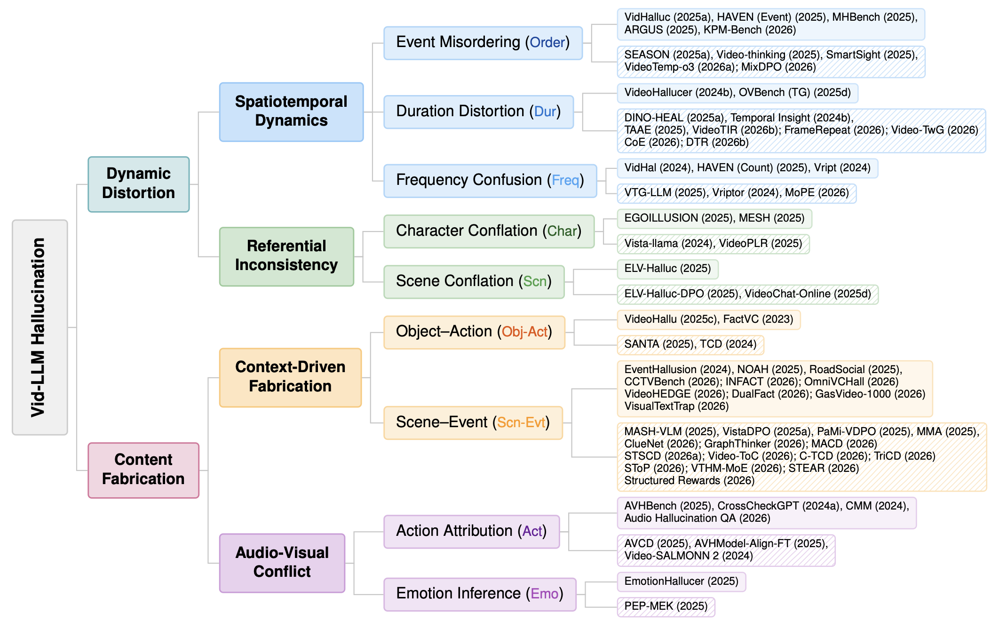

# Awesome-Video-Hallucination [](https://awesome.re)

[](https://arxiv.org/abs/2604.12944) [](https://arxiv.org/abs/2604.12944) [](#evaluation-benchmarks) [](new_papers.md) [](LICENSE) [](#contributing) [](https://github.com) [](https://github.com/hukcc/Awesome-Video-Hallucination/commits/main) 

A curated and structured collection of papers on **hallucination in Video Large Language Models (Vid-LLMs)**, covering **29 evaluation benchmarks** and **42 mitigation methods**. Automatically updated monthly via arXiv search.

> 📄 **Based on the survey**: *[Distorted or Fabricated? A Survey on Hallucination in Video LLMs](https://arxiv.org/abs/2604.12944)*


## Overview at a Glance

<table width="100%">
<tr>
<td width="20%" align="center"><h3>📊 29</h3><sub>Evaluation Benchmarks</sub></td>
<td width="20%" align="center"><h3>🛠️ 42</h3><sub>Mitigation Methods</sub></td>
<td width="20%" align="center"><h3>🏛️ 15+</h3><sub>Top-tier Venues</sub></td>
<td width="20%" align="center"><h3>📅 2023–2026</h3><sub>Coverage Period</sub></td>
<td width="20%" align="center"><h3>🤖 Auto</h3><sub>Monthly Paper Update</sub></td>
</tr>
</table>

## 🔔 News

- **[2026/05]** 📚 Classified recent papers from [`new_papers.md`](new_papers.md), expanding the taxonomy to 29 video hallucination benchmarks and 42 mitigation methods.
- **[2026/04]** 🌟 Our survey has been accepted to **ACL 2026 Findings**! 👉 [arXiv:2604.12944](https://arxiv.org/abs/2604.12944)
- **[2026/03]** 🤖 Automated monthly arXiv paper update is now live! A GitHub Action runs on the 1st of each month to find new video hallucination papers and commit directly to the main branch. Newly discovered papers that have not yet been classified can be found in [`new_papers.md`](new_papers.md).

---

<details open>
<summary><b>📖 Table of Contents</b></summary>

&emsp;📋 [Taxonomy of Video Hallucinations](#taxonomy-of-video-hallucinations)
<br>&emsp;📊 [Evaluation Benchmarks](#evaluation-benchmarks) — 29 benchmarks
<br>&emsp;&emsp;&emsp;🔵 [Spatiotemporal Dynamics](#-spatiotemporal-dynamics-benchmarks-dynamic-distortion)
<br>&emsp;&emsp;&emsp;🟢 [Referential Inconsistency](#-referential-inconsistency-benchmarks-dynamic-distortion)
<br>&emsp;&emsp;&emsp;🟠 [Context-Driven Fabrication](#-context-driven-fabrication-benchmarks-content-fabrication)
<br>&emsp;&emsp;&emsp;🟣 [Audio-Visual Conflict](#-audio-visual-conflict-benchmarks-content-fabrication)
<br>&emsp;🛠️ [Mitigation Strategies](#mitigation-strategies) — 42 methods
<br>&emsp;&emsp;&emsp;🔵 [Spatiotemporal Dynamics](#-spatiotemporal-dynamics-mitigation-dynamic-distortion)
<br>&emsp;&emsp;&emsp;🟢 [Referential Inconsistency](#-referential-inconsistency-mitigation-dynamic-distortion)
<br>&emsp;&emsp;&emsp;🟠 [Context-Driven Fabrication](#-context-driven-fabrication-mitigation-content-fabrication)
<br>&emsp;&emsp;&emsp;🟣 [Audio-Visual Conflict](#-audio-visual-conflict-mitigation-content-fabrication)
<br>&emsp;🤝 [Contributing](#contributing)

</details>

---

## Taxonomy of Video Hallucinations

We propose a **mechanism-driven taxonomy** that classifies hallucinations in Video Large Language Models (Vid-LLMs) into two primary types:

<table>
<tr>
<td width="50%" valign="top">

🔷 **Dynamic Distortion**

The model correctly detects entities but misrepresents their temporal progression or referential consistency.

- 🔵 *Spatiotemporal Dynamics* — Errors in event ordering, duration estimation, or frequency counting.
- 🟢 *Referential Inconsistency* — Characters or scenes are conflated across temporal boundaries.

</td>
<td width="50%" valign="top">

🔶 **Content Fabrication**

The model produces outputs that lack grounding in visual evidence and are instead influenced by learned priors.

- 🟠 *Context-Driven Fabrication* — Common object-action or scene-event associations lead to unsupported predictions.
- 🟣 *Audio-Visual Conflict* — Dominant auditory cues override visual input.

</td>
</tr>
</table>

<p align="center">
    
    <br>
    <em>Mechanism-driven taxonomy of Vid-LLM hallucinations. Solid fill = benchmarks; striped fill = mitigation methods.</em>
</p>

---

## Evaluation Benchmarks

> [!NOTE]
> Benchmarks are organized by our mechanism-driven taxonomy. Each entry includes venue, date, and links to code/project pages where available.
>
> **Legend:** <a href="#"></a> = Project Page &ensp; <a href="#"></a> = GitHub Repository &ensp; `-` = Not Available

### 🔵 Spatiotemporal Dynamics Benchmarks (Dynamic Distortion)

<details open>
<summary><b>Event Misordering</b> (5 papers)</summary>

<table width="100%">
  <thead>
    <tr>
      <th width="54%" align="left">Title</th>
      <th width="12%" align="center">Benchmark</th>
      <th width="10%" align="center">Venue</th>
      <th width="7%" align="center">Date</th>
      <th width="17%" align="center">Code</th>
    </tr>
  </thead>
  <tbody>
    <tr>
      <td align="left"><a href="https://arxiv.org/abs/2412.03735"><b>VidHalluc: Evaluating Temporal Hallucinations in Multimodal Large Language Models for Video Understanding</b></a></td>
      <td align="center">VidHalluc</td>
      <td align="center">CVPR 2025</td>
      <td align="center">12/2024</td>
      <td align="center"><a href="https://people-robots.github.io/vidhalluc"></a> <a href="https://github.com/CyL97/VidHalluc"></a></td>
    </tr>
    <tr>
      <td align="left"><a href="https://arxiv.org/abs/2503.19622"><b>Exploring Hallucination of Large Multimodal Models in Video Understanding: Benchmark, Analysis and Mitigation</b></a></td>
      <td align="center">HAVEN</td>
      <td align="center">arXiv 2025</td>
      <td align="center">03/2025</td>
      <td align="center"><a href="https://github.com/Hongcheng-Gao/HAVEN"></a></td>
    </tr>
    <tr>
      <td align="left"><a href="https://ojs.aaai.org/index.php/AAAI/article/view/32463"><b>MHBench: Demystifying Motion Hallucination in VideoLLMs</b></a></td>
      <td align="center">MHBench</td>
      <td align="center">AAAI 2025</td>
      <td align="center">01/2025</td>
      <td align="center"><a href="https://github.com/xzhouzeng/MHBench"></a></td>
    </tr>
    <tr>
      <td align="left"><a href="https://arxiv.org/abs/2602.17768"><b>KPM-Bench: A Kinematic Parsing Motion Benchmark for Fine-grained Motion-centric Video Understanding</b></a></td>
      <td align="center">KPM-Bench</td>
      <td align="center">arXiv 2026</td>
      <td align="center">02/2026</td>
      <td align="center">-</td>
    </tr>
    <tr>
      <td align="left"><a href="https://arxiv.org/abs/2506.07371"><b>ARGUS: Hallucination and Omission Evaluation in Video-LLMs</b></a></td>
      <td align="center">ARGUS</td>
      <td align="center">ICCV 2025</td>
      <td align="center">06/2025</td>
      <td align="center"><a href="https://github.com/JARVVVIS/argus"></a></td>
    </tr>
  </tbody>
</table>

</details>

<details open>
<summary><b>Duration Distortion</b> (2 papers)</summary>

<table width="100%">
  <thead>
    <tr>
      <th width="54%" align="left">Title</th>
      <th width="12%" align="center">Benchmark</th>
      <th width="10%" align="center">Venue</th>
      <th width="7%" align="center">Date</th>
      <th width="17%" align="center">Code</th>
    </tr>
  </thead>
  <tbody>
    <tr>
      <td align="left"><a href="https://arxiv.org/abs/2406.16338"><b>VideoHallucer: Evaluating Intrinsic and Extrinsic Hallucinations in Large Video-Language Models</b></a></td>
      <td align="center">VideoHallucer</td>
      <td align="center">arXiv 2024</td>
      <td align="center">06/2024</td>
      <td align="center"><a href="https://github.com/patrick-tssn/VideoHallucer"></a></td>
    </tr>
    <tr>
      <td align="left"><a href="https://arxiv.org/abs/2501.00584"><b>Online Video Understanding: OVBench and VideoChat-Online</b></a></td>
      <td align="center">OVBench</td>
      <td align="center">CVPR 2025</td>
      <td align="center">01/2025</td>
      <td align="center"><a href="https://videochat-online.github.io/"></a> <a href="https://github.com/mcg-nju/videochat-online"></a></td>
    </tr>
  </tbody>
</table>

</details>

<details open>
<summary><b>Frequency Confusion</b> (2 papers)</summary>

<table width="100%">
  <thead>
    <tr>
      <th width="54%" align="left">Title</th>
      <th width="12%" align="center">Benchmark</th>
      <th width="10%" align="center">Venue</th>
      <th width="7%" align="center">Date</th>
      <th width="17%" align="center">Code</th>
    </tr>
  </thead>
  <tbody>
    <tr>
      <td align="left"><a href="https://arxiv.org/abs/2411.16771"><b>VidHal: Benchmarking Temporal Hallucinations in Vision LLMs</b></a></td>
      <td align="center">VidHal</td>
      <td align="center">arXiv 2024</td>
      <td align="center">11/2024</td>
      <td align="center"><a href="https://github.com/Lookuz/VidHal"></a></td>
    </tr>
    <tr>
      <td align="left"><a href="https://arxiv.org/abs/2406.06040"><b>Vript: A Video Is Worth Thousands of Words</b></a></td>
      <td align="center">Vript</td>
      <td align="center">NeurIPS 2024</td>
      <td align="center">06/2024</td>
      <td align="center"><a href="https://github.com/mutonix/Vript"></a></td>
    </tr>
  </tbody>
</table>

</details>

### 🟢 Referential Inconsistency Benchmarks (Dynamic Distortion)

<details open>
<summary><b>Character Conflation</b> (2 papers)</summary>

<table width="100%">
  <thead>
    <tr>
      <th width="54%" align="left">Title</th>
      <th width="12%" align="center">Benchmark</th>
      <th width="10%" align="center">Venue</th>
      <th width="7%" align="center">Date</th>
      <th width="17%" align="center">Code</th>
    </tr>
  </thead>
  <tbody>
    <tr>
      <td align="left"><a href="https://aclanthology.org/2025.emnlp-main.1446/"><b>EGOILLUSION: Benchmarking Hallucinations in Egocentric Video Understanding</b></a></td>
      <td align="center">EGOILLUSION</td>
      <td align="center">EMNLP 2025</td>
      <td align="center">11/2025</td>
      <td align="center"><a href="https://sites.google.com/view/egoillusion-demo/home"></a></td>
    </tr>
    <tr>
      <td align="left"><a href="https://arxiv.org/abs/2509.08538"><b>MESH: Measuring Hallucinations in Large Video Models</b></a></td>
      <td align="center">MESH</td>
      <td align="center">ACM MM 2025</td>
      <td align="center">09/2025</td>
      <td align="center"><a href="https://github.com/HCYANG2000/MESH-Benchmark"></a></td>
    </tr>
  </tbody>
</table>

</details>

<details open>
<summary><b>Scene Conflation</b> (1 paper)</summary>

<table width="100%">
  <thead>
    <tr>
      <th width="54%" align="left">Title</th>
      <th width="12%" align="center">Benchmark</th>
      <th width="10%" align="center">Venue</th>
      <th width="7%" align="center">Date</th>
      <th width="17%" align="center">Code</th>
    </tr>
  </thead>
  <tbody>
    <tr>
      <td align="left"><a href="https://arxiv.org/abs/2508.21496"><b>ELV-Halluc: Benchmarking Semantic Aggregation Hallucinations in Long Video Understanding</b></a></td>
      <td align="center">ELV-Halluc</td>
      <td align="center">arXiv 2025</td>
      <td align="center">08/2025</td>
      <td align="center"><a href="https://github.com/hlsv02/ELV-Halluc"></a></td>
    </tr>
  </tbody>
</table>

</details>

### 🟠 Context-Driven Fabrication Benchmarks (Content Fabrication)

<details open>
<summary><b>Object-Action Hallucination</b> (2 papers)</summary>

<table width="100%">
  <thead>
    <tr>
      <th width="54%" align="left">Title</th>
      <th width="12%" align="center">Benchmark</th>
      <th width="10%" align="center">Venue</th>
      <th width="7%" align="center">Date</th>
      <th width="17%" align="center">Code</th>
    </tr>
  </thead>
  <tbody>
    <tr>
      <td align="left"><a href="https://arxiv.org/abs/2505.01481"><b>VideoHallu: Evaluating and Mitigating Multi-modal Hallucinations on Synthetic Video Understanding</b></a></td>
      <td align="center">VideoHallu</td>
      <td align="center">NeurIPS 2025</td>
      <td align="center">05/2025</td>
      <td align="center"><a href="https://github.com/zli12321/VideoHallu"></a></td>
    </tr>
    <tr>
      <td align="left"><a href="https://arxiv.org/abs/2303.02961"><b>Models See Hallucinations: Evaluating the Factuality in Video Captioning</b></a></td>
      <td align="center">FactVC</td>
      <td align="center">EMNLP 2023</td>
      <td align="center">03/2023</td>
      <td align="center"><a href="https://github.com/PKULiuHui/FactVC"></a></td>
    </tr>
  </tbody>
</table>

</details>

<details open>
<summary><b>Scene-Event Hallucination</b> (4 papers)</summary>

<table width="100%">
  <thead>
    <tr>
      <th width="54%" align="left">Title</th>
      <th width="12%" align="center">Benchmark</th>
      <th width="10%" align="center">Venue</th>
      <th width="7%" align="center">Date</th>
      <th width="17%" align="center">Code</th>
    </tr>
  </thead>
  <tbody>
    <tr>
      <td align="left"><a href="https://arxiv.org/abs/2409.16597"><b>EventHallusion: Diagnosing Event Hallucinations in Video LLMs</b></a></td>
      <td align="center">EventHallusion</td>
      <td align="center">arXiv 2024</td>
      <td align="center">09/2024</td>
      <td align="center"><a href="https://github.com/Stevetich/EventHallusion"></a></td>
    </tr>
    <tr>
      <td align="left"><a href="https://arxiv.org/abs/2511.06475"><b>NOAH: Benchmarking Narrative Prior driven Hallucination and Omission in Video Large Language Models</b></a></td>
      <td align="center">NOAH</td>
      <td align="center">arXiv 2025</td>
      <td align="center">11/2025</td>
      <td align="center"><a href="https://anonymous550520.github.io/"></a> <a href="https://github.com/anonymous550520/NOAH"></a></td>
    </tr>
    <tr>
      <td align="left"><a href="https://openaccess.thecvf.com/content/CVPR2025/papers/Parikh_RoadSocial_A_Diverse_VideoQA_Dataset_and_Benchmark_for_Road_Event_CVPR_2025_paper.pdf"><b>RoadSocial: A Diverse VideoQA Dataset and Benchmark for Road Event Understanding from Social Video Narratives</b></a></td>
      <td align="center">RoadSocial</td>
      <td align="center">CVPR 2025</td>
      <td align="center">02/2025</td>
      <td align="center"><a href="https://roadsocial.github.io/"></a> <a href="https://github.com/roadsocial/roadsocial"></a></td>
    </tr>
    <tr>
      <td align="left"><a href="https://arxiv.org/abs/2604.20460"><b>CCTVBench: Contrastive Consistency Traffic VideoQA Benchmark for Multimodal LLMs</b></a></td>
      <td align="center">CCTVBench</td>
      <td align="center">arXiv 2026</td>
      <td align="center">04/2026</td>
      <td align="center">-</td>
    </tr>
  </tbody>
</table>

</details>

<details open>
<summary><b>Compositional and Factuality Hallucination</b> (6 papers)</summary>

<table width="100%">
  <thead>
    <tr>
      <th width="54%" align="left">Title</th>
      <th width="12%" align="center">Benchmark</th>
      <th width="10%" align="center">Venue</th>
      <th width="7%" align="center">Date</th>
      <th width="17%" align="center">Code</th>
    </tr>
  </thead>
  <tbody>
    <tr>
      <td align="left"><a href="https://arxiv.org/abs/2603.11481"><b>INFACT: A Diagnostic Benchmark for Induced Faithfulness and Factuality Hallucinations in Video-LLMs</b></a></td>
      <td align="center">INFACT</td>
      <td align="center">arXiv 2026</td>
      <td align="center">03/2026</td>
      <td align="center">-</td>
    </tr>
    <tr>
      <td align="left"><a href="https://arxiv.org/abs/2602.00559"><b>Learning to Decode Against Compositional Hallucination in Video Multimodal Large Language Models</b></a></td>
      <td align="center">OmniVCHall</td>
      <td align="center">arXiv 2026</td>
      <td align="center">01/2026</td>
      <td align="center"><a href="https://github.com/BMRETURN/OmniVCHall"></a></td>
    </tr>
    <tr>
      <td align="left"><a href="https://arxiv.org/abs/2601.08557"><b>VideoHEDGE: Entropy-Based Hallucination Detection for Video-VLMs via Semantic Clustering and Spatiotemporal Perturbations</b></a></td>
      <td align="center">VideoHEDGE</td>
      <td align="center">arXiv 2026</td>
      <td align="center">01/2026</td>
      <td align="center"><a href="https://github.com/Simula/HEDGE"></a></td>
    </tr>
    <tr>
      <td align="left"><a href="https://arxiv.org/abs/2604.25584"><b>DualFact+: A Multimodal Fact Verification Framework for Procedural Video Understanding</b></a></td>
      <td align="center">DualFact</td>
      <td align="center">ACL 2026 Findings</td>
      <td align="center">04/2026</td>
      <td align="center">-</td>
    </tr>
    <tr>
      <td align="left"><a href="https://arxiv.org/abs/2604.17873"><b>Spatiotemporal Sycophancy: Negation-Based Gaslighting in Video Large Language Models</b></a></td>
      <td align="center">GasVideo-1000</td>
      <td align="center">arXiv 2026</td>
      <td align="center">04/2026</td>
      <td align="center"><a href="https://pengkun-jiao.github.io/GasVideo-1000"></a></td>
    </tr>
    <tr>
      <td align="left"><a href="https://arxiv.org/abs/2604.17375"><b>When Text Hijacks Vision: Benchmarking and Mitigating Text Overlay-Induced Hallucination in Vision Language Models</b></a></td>
      <td align="center">VisualTextTrap</td>
      <td align="center">arXiv 2026</td>
      <td align="center">04/2026</td>
      <td align="center">-</td>
    </tr>
  </tbody>
</table>

</details>

### 🟣 Audio-Visual Conflict Benchmarks (Content Fabrication)

<details open>
<summary><b>Action Attribution</b> (4 papers)</summary>

<table width="100%">
  <thead>
    <tr>
      <th width="54%" align="left">Title</th>
      <th width="12%" align="center">Benchmark</th>
      <th width="10%" align="center">Venue</th>
      <th width="7%" align="center">Date</th>
      <th width="17%" align="center">Code</th>
    </tr>
  </thead>
  <tbody>
    <tr>
      <td align="left"><a href="https://arxiv.org/abs/2410.18325"><b>AVHBench: A Cross-Modal Hallucination Benchmark for Audio-Visual Large Language Models</b></a></td>
      <td align="center">AVHBench</td>
      <td align="center">ICLR 2025</td>
      <td align="center">10/2024</td>
      <td align="center"><a href="https://github.com/kaist-ami/AVHBench"></a></td>
    </tr>
    <tr>
      <td align="left"><a href="https://arxiv.org/abs/2410.12787"><b>The Curse of Multi-Modalities: Evaluating Hallucinations of Large Multimodal Models across Language, Visual, and Audio</b></a></td>
      <td align="center">CMM</td>
      <td align="center">arXiv 2024</td>
      <td align="center">10/2024</td>
      <td align="center"><a href="https://cmm-damovl.site/"></a> <a href="https://github.com/DAMO-NLP-SG/CMM"></a></td>
    </tr>
    <tr>
      <td align="left"><a href="https://arxiv.org/abs/2604.23860"><b>Exploring Audio Hallucination in Egocentric Video Understanding</b></a></td>
      <td align="center">Audio Hallucination QA</td>
      <td align="center">ICASSP 2026</td>
      <td align="center">04/2026</td>
      <td align="center">-</td>
    </tr>
    <tr>
      <td align="left"><a href="https://arxiv.org/abs/2405.13684"><b>CrossCheckGPT: Universal Hallucination Ranking for Multimodal Foundation Models</b></a></td>
      <td align="center">AVHalluBench</td>
      <td align="center">arXiv 2024</td>
      <td align="center">05/2024</td>
      <td align="center"><a href="https://huggingface.co/datasets/scb10x/avhallubench"></a> <a href="https://huggingface.co/spaces/scb10x/multimodal-hallucination-leaderboard"></a></td>
    </tr>
  </tbody>
</table>

</details>

<details open>
<summary><b>Emotion Inference</b> (1 paper)</summary>

<table width="100%">
  <thead>
    <tr>
      <th width="54%" align="left">Title</th>
      <th width="12%" align="center">Benchmark</th>
      <th width="10%" align="center">Venue</th>
      <th width="7%" align="center">Date</th>
      <th width="17%" align="center">Code</th>
    </tr>
  </thead>
  <tbody>
    <tr>
      <td align="left"><a href="https://arxiv.org/abs/2505.11405"><b>EmotionHallucer: Evaluating Emotion Hallucinations in Multimodal Large Language Models</b></a></td>
      <td align="center">EmotionHallucer</td>
      <td align="center">arXiv 2025</td>
      <td align="center">05/2025</td>
      <td align="center"><a href="https://github.com/xxtars/EmotionHallucer"></a></td>
    </tr>
  </tbody>
</table>

</details>

---

## Mitigation Strategies

> [!NOTE]
> Methods are classified by the type of hallucination they target. The **Training-Free** column indicates whether the method requires additional training (✘) or not (✔︎).

### 🔵 Spatiotemporal Dynamics Mitigation (Dynamic Distortion)

<details open>
<summary><b>Event Misordering</b> (5 papers)</summary>

<table width="100%">
  <thead>
    <tr>
      <th width="42%" align="left">Title</th>
      <th width="13%" align="center">Method</th>
      <th width="10%" align="center">Venue</th>
      <th width="7%" align="center">Date</th>
      <th width="11%" align="center">Training-Free</th>
      <th width="17%" align="center">Code</th>
    </tr>
  </thead>
  <tbody>
    <tr>
      <td align="left"><a href="https://arxiv.org/abs/2512.04643"><b>SEASON: Mitigating Temporal Hallucination in Video LLMs via Self-Diagnostic Contrastive Decoding</b></a></td>
      <td align="center">SEASON</td>
      <td align="center">arXiv 2025</td>
      <td align="center">12/2025</td>
      <td align="center">✔︎</td>
      <td align="center">-</td>
    </tr>
    <tr>
      <td align="left"><a href="https://arxiv.org/abs/2503.19622"><b>Exploring Hallucination of Large Multimodal Models in Video Understanding: Benchmark, Analysis and Mitigation</b></a></td>
      <td align="center">Video-thinking (TDPO)</td>
      <td align="center">arXiv 2025</td>
      <td align="center">03/2025</td>
      <td align="center">✘</td>
      <td align="center"><a href="https://github.com/Hongcheng-Gao/HAVEN"></a></td>
    </tr>
    <tr>
      <td align="left"><a href="https://arxiv.org/abs/2512.18671"><b>SmartSight: Mitigating Hallucination in Video-LLMs via Temporal Attention Collapse</b></a></td>
      <td align="center">SmartSight</td>
      <td align="center">AAAI 2026</td>
      <td align="center">12/2025</td>
      <td align="center">✔︎</td>
      <td align="center">-</td>
    </tr>
    <tr>
      <td align="left"><a href="https://arxiv.org/abs/2602.07801"><b>VideoTemp-o3: Harmonizing Temporal Grounding and Video Understanding in Agentic Thinking-with-Videos</b></a></td>
      <td align="center">VideoTemp-o3</td>
      <td align="center">arXiv 2026</td>
      <td align="center">02/2026</td>
      <td align="center">✘</td>
      <td align="center"><a href="https://liuwq-bit.github.io/VideoTemp-o3/"></a> <a href="https://github.com/Kwai-Keye/VideoTemp-o3"></a></td>
    </tr>
    <tr>
      <td align="left"><a href="https://arxiv.org/abs/2601.04778"><b>CounterVid: Counterfactual Video Generation for Mitigating Action and Temporal Hallucinations in Video-Language Models</b></a></td>
      <td align="center">MixDPO</td>
      <td align="center">arXiv 2026</td>
      <td align="center">01/2026</td>
      <td align="center">✘</td>
      <td align="center">-</td>
    </tr>
  </tbody>
</table>

</details>

<details open>
<summary><b>Duration Distortion</b> (8 papers)</summary>

<table width="100%">
  <thead>
    <tr>
      <th width="42%" align="left">Title</th>
      <th width="13%" align="center">Method</th>
      <th width="10%" align="center">Venue</th>
      <th width="7%" align="center">Date</th>
      <th width="11%" align="center">Training-Free</th>
      <th width="17%" align="center">Code</th>
    </tr>
  </thead>
  <tbody>
    <tr>
      <td align="left"><a href="https://arxiv.org/abs/2401.09861"><b>Temporal Insight Enhancement: Mitigating Temporal Hallucination in Video Understanding by MLLMs</b></a></td>
      <td align="center">Temporal Insight</td>
      <td align="center">ICPR 2024</td>
      <td align="center">01/2024</td>
      <td align="center">✔︎</td>
      <td align="center">-</td>
    </tr>
    <tr>
      <td align="left"><a href="https://arxiv.org/abs/2412.03735"><b>VidHalluc: Evaluating Temporal Hallucinations in Multimodal Large Language Models for Video Understanding</b></a></td>
      <td align="center">DINO-HEAL</td>
      <td align="center">CVPR 2025</td>
      <td align="center">12/2024</td>
      <td align="center">✔︎</td>
      <td align="center"><a href="https://people-robots.github.io/vidhalluc"></a> <a href="https://github.com/CyL97/VidHalluc"></a></td>
    </tr>
    <tr>
      <td align="left"><a href="https://arxiv.org/abs/2505.12826"><b>Mitigating Hallucination in VideoLLMs via Temporal-Aware Activation Engineering</b></a></td>
      <td align="center">TAAE</td>
      <td align="center">arXiv 2025</td>
      <td align="center">05/2025</td>
      <td align="center">✘</td>
      <td align="center">-</td>
    </tr>
    <tr>
      <td align="left"><a href="https://arxiv.org/abs/2603.25021"><b>VideoTIR: Accurate Understanding for Long Videos with Efficient Tool-Integrated Reasoning</b></a></td>
      <td align="center">VideoTIR</td>
      <td align="center">arXiv 2026</td>
      <td align="center">03/2026</td>
      <td align="center">✘</td>
      <td align="center">-</td>
    </tr>
    <tr>
      <td align="left"><a href="https://arxiv.org/abs/2603.16256"><b>When Thinking Hurts: Mitigating Visual Forgetting in Video Reasoning via Frame Repetition</b></a></td>
      <td align="center">FrameRepeat</td>
      <td align="center">arXiv 2026</td>
      <td align="center">03/2026</td>
      <td align="center">✘</td>
      <td align="center">-</td>
    </tr>
    <tr>
      <td align="left"><a href="https://arxiv.org/abs/2602.18702"><b>Think with Grounding: Curriculum Reinforced Reasoning with Video Grounding for Long Video Understanding</b></a></td>
      <td align="center">Video-TwG</td>
      <td align="center">arXiv 2026</td>
      <td align="center">02/2026</td>
      <td align="center">✘</td>
      <td align="center">-</td>
    </tr>
    <tr>
      <td align="left"><a href="https://arxiv.org/abs/2601.07761"><b>Video Evidence to Reasoning Efficient Video Understanding via Explicit Evidence Grounding</b></a></td>
      <td align="center">CoE</td>
      <td align="center">ICME 2026</td>
      <td align="center">01/2026</td>
      <td align="center">✘</td>
      <td align="center">-</td>
    </tr>
    <tr>
      <td align="left"><a href="https://arxiv.org/abs/2604.12582"><b>Relaxing Anchor-Frame Dominance for Mitigating Hallucinations in Video Large Language Models</b></a></td>
      <td align="center">DTR</td>
      <td align="center">arXiv 2026</td>
      <td align="center">04/2026</td>
      <td align="center">✔︎</td>
      <td align="center">-</td>
    </tr>
  </tbody>
</table>

</details>

<details open>
<summary><b>Frequency Confusion</b> (3 papers)</summary>

<table width="100%">
  <thead>
    <tr>
      <th width="42%" align="left">Title</th>
      <th width="13%" align="center">Method</th>
      <th width="10%" align="center">Venue</th>
      <th width="7%" align="center">Date</th>
      <th width="11%" align="center">Training-Free</th>
      <th width="17%" align="center">Code</th>
    </tr>
  </thead>
  <tbody>
    <tr>
      <td align="left"><a href="https://arxiv.org/abs/2405.13382"><b>VTG-LLM: Integrating Timestamp Knowledge into Video LLMs for Enhanced Video Temporal Grounding</b></a></td>
      <td align="center">VTG-LLM</td>
      <td align="center">AAAI 2025</td>
      <td align="center">05/2024</td>
      <td align="center">✘</td>
      <td align="center"><a href="https://github.com/gyxxyg/VTG-LLM"></a></td>
    </tr>
    <tr>
      <td align="left"><a href="https://arxiv.org/abs/2406.06040"><b>Vript: A Video Is Worth Thousands of Words</b></a></td>
      <td align="center">Vriptor</td>
      <td align="center">NeurIPS 2024</td>
      <td align="center">06/2024</td>
      <td align="center">✘</td>
      <td align="center"><a href="https://github.com/mutonix/Vript"></a></td>
    </tr>
    <tr>
      <td align="left"><a href="https://arxiv.org/abs/2602.17768"><b>KPM-Bench: A Kinematic Parsing Motion Benchmark for Fine-grained Motion-centric Video Understanding</b></a></td>
      <td align="center">MoPE</td>
      <td align="center">arXiv 2026</td>
      <td align="center">02/2026</td>
      <td align="center">✘</td>
      <td align="center">-</td>
    </tr>
  </tbody>
</table>

</details>

### 🟢 Referential Inconsistency Mitigation (Dynamic Distortion)

<details open>
<summary><b>Character Conflation</b> (2 papers)</summary>

<table width="100%">
  <thead>
    <tr>
      <th width="42%" align="left">Title</th>
      <th width="13%" align="center">Method</th>
      <th width="10%" align="center">Venue</th>
      <th width="7%" align="center">Date</th>
      <th width="11%" align="center">Training-Free</th>
      <th width="17%" align="center">Code</th>
    </tr>
  </thead>
  <tbody>
    <tr>
      <td align="left"><a href="https://arxiv.org/abs/2312.08870"><b>Vista-LLaMA: Reducing Hallucination in Video Language Models via Equal Distance to Visual Tokens</b></a></td>
      <td align="center">Vista-LLaMA</td>
      <td align="center">CVPR 2024</td>
      <td align="center">12/2023</td>
      <td align="center">✘</td>
      <td align="center"><a href="https://jinxxian.github.io/Vista-LLaMA/"></a> <a href="https://github.com/Flowerfan/VistaLLaMA"></a></td>
    </tr>
    <tr>
      <td align="left"><a href="https://arxiv.org/abs/2511.18463"><b>Alternating Perception-Reasoning for Hallucination-Resistant Video Understanding</b></a></td>
      <td align="center">VideoPLR</td>
      <td align="center">arXiv 2025</td>
      <td align="center">11/2025</td>
      <td align="center">✘</td>
      <td align="center"><a href="https://github.com/BoweiPu/VideoPLR"></a></td>
    </tr>
  </tbody>
</table>

</details>

<details open>
<summary><b>Scene Conflation</b> (2 papers)</summary>

<table width="100%">
  <thead>
    <tr>
      <th width="42%" align="left">Title</th>
      <th width="13%" align="center">Method</th>
      <th width="10%" align="center">Venue</th>
      <th width="7%" align="center">Date</th>
      <th width="11%" align="center">Training-Free</th>
      <th width="17%" align="center">Code</th>
    </tr>
  </thead>
  <tbody>
    <tr>
      <td align="left"><a href="https://arxiv.org/abs/2508.21496"><b>ELV-Halluc: Benchmarking Semantic Aggregation Hallucinations in Long Video Understanding</b></a></td>
      <td align="center">ELV-Halluc-DPO</td>
      <td align="center">arXiv 2025</td>
      <td align="center">08/2025</td>
      <td align="center">✘</td>
      <td align="center"><a href="https://github.com/hlsv02/ELV-Halluc"></a></td>
    </tr>
    <tr>
      <td align="left"><a href="https://arxiv.org/abs/2501.00584"><b>Online Video Understanding: OVBench and VideoChat-Online</b></a></td>
      <td align="center">VideoChat-Online</td>
      <td align="center">CVPR 2025</td>
      <td align="center">01/2025</td>
      <td align="center">✘</td>
      <td align="center"><a href="https://videochat-online.github.io/"></a> <a href="https://github.com/mcg-nju/videochat-online"></a></td>
    </tr>
  </tbody>
</table>

</details>

### 🟠 Context-Driven Fabrication Mitigation (Content Fabrication)

<details open>
<summary><b>Object-Action Hallucination</b> (2 papers)</summary>

<table width="100%">
  <thead>
    <tr>
      <th width="42%" align="left">Title</th>
      <th width="13%" align="center">Method</th>
      <th width="10%" align="center">Venue</th>
      <th width="7%" align="center">Date</th>
      <th width="11%" align="center">Training-Free</th>
      <th width="17%" align="center">Code</th>
    </tr>
  </thead>
  <tbody>
    <tr>
      <td align="left"><a href="https://arxiv.org/abs/2512.04356"><b>Mitigating Object and Action Hallucinations in Multimodal LLMs via Self-Augmented Contrastive Alignment</b></a></td>
      <td align="center">SANTA</td>
      <td align="center">WACV 2026</td>
      <td align="center">12/2025</td>
      <td align="center">✘</td>
      <td align="center"><a href="https://kpc0810.github.io/santa/"></a></td>
    </tr>
    <tr>
      <td align="left"><a href="https://arxiv.org/abs/2409.16597"><b>EventHallusion: Diagnosing Event Hallucinations in Video LLMs</b></a></td>
      <td align="center">TCD</td>
      <td align="center">arXiv 2024</td>
      <td align="center">09/2024</td>
      <td align="center">✔︎</td>
      <td align="center"><a href="https://github.com/Stevetich/EventHallusion"></a></td>
    </tr>
  </tbody>
</table>

</details>

<details open>
<summary><b>Scene-Event Hallucination</b> (9 papers)</summary>

<table width="100%">
  <thead>
    <tr>
      <th width="42%" align="left">Title</th>
      <th width="13%" align="center">Method</th>
      <th width="10%" align="center">Venue</th>
      <th width="7%" align="center">Date</th>
      <th width="11%" align="center">Training-Free</th>
      <th width="17%" align="center">Code</th>
    </tr>
  </thead>
  <tbody>
    <tr>
      <td align="left"><a href="https://arxiv.org/abs/2503.15871"><b>MASH-VLM: Mitigating Action-Scene Hallucination in Video-LLMs through Disentangled Spatial-Temporal Representations</b></a></td>
      <td align="center">MASH-VLM</td>
      <td align="center">CVPR 2025</td>
      <td align="center">03/2025</td>
      <td align="center">✘</td>
      <td align="center">-</td>
    </tr>
    <tr>
      <td align="left"><a href="https://arxiv.org/abs/2504.05810"><b>PaMi-VDPO: Mitigating Video Hallucinations by Prompt-Aware Multi-Instance Video Preference Learning</b></a></td>
      <td align="center">PaMi-VDPO</td>
      <td align="center">arXiv 2025</td>
      <td align="center">04/2025</td>
      <td align="center">✘</td>
      <td align="center">-</td>
    </tr>
    <tr>
      <td align="left"><a href="https://www.ijcai.org/proceedings/2025/1019"><b>Hallucination Reduction in Video-Language Models via Hierarchical Multimodal Consistency</b></a></td>
      <td align="center">MMA</td>
      <td align="center">IJCAI 2025</td>
      <td align="center">08/2025</td>
      <td align="center">✘</td>
      <td align="center">-</td>
    </tr>
    <tr>
      <td align="left"><a href="https://arxiv.org/abs/2603.15008"><b>Clue Matters: Leveraging Latent Visual Clues to Empower Video Reasoning</b></a></td>
      <td align="center">ClueNet</td>
      <td align="center">arXiv 2026</td>
      <td align="center">03/2026</td>
      <td align="center">✘</td>
      <td align="center">-</td>
    </tr>
    <tr>
      <td align="left"><a href="https://arxiv.org/abs/2602.17555"><b>GraphThinker: Reinforcing Video Reasoning with Event Graph Thinking</b></a></td>
      <td align="center">GraphThinker</td>
      <td align="center">arXiv 2026</td>
      <td align="center">02/2026</td>
      <td align="center">✘</td>
      <td align="center">-</td>
    </tr>
    <tr>
      <td align="left"><a href="https://arxiv.org/abs/2602.01740"><b>MACD: Model-Aware Contrastive Decoding via Counterfactual Data</b></a></td>
      <td align="center">MACD</td>
      <td align="center">arXiv 2026</td>
      <td align="center">02/2026</td>
      <td align="center">✔︎</td>
      <td align="center">-</td>
    </tr>
    <tr>
      <td align="left"><a href="https://arxiv.org/abs/2601.22574"><b>Mitigating Hallucinations in Video Large Language Models via Spatiotemporal-Semantic Contrastive Decoding</b></a></td>
      <td align="center">STSCD</td>
      <td align="center">arXiv 2026</td>
      <td align="center">01/2026</td>
      <td align="center">✔︎</td>
      <td align="center">-</td>
    </tr>
    <tr>
      <td align="left"><a href="https://arxiv.org/abs/2604.20473"><b>Video-ToC: Video Tree-of-Cue Reasoning</b></a></td>
      <td align="center">Video-ToC</td>
      <td align="center">arXiv 2026</td>
      <td align="center">04/2026</td>
      <td align="center">✘</td>
      <td align="center"><a href="https://github.com/qizhongtan/Video-ToC"></a></td>
    </tr>
    <tr>
      <td align="left"><a href="https://arxiv.org/abs/2604.20460"><b>CCTVBench: Contrastive Consistency Traffic VideoQA Benchmark for Multimodal LLMs</b></a></td>
      <td align="center">C-TCD</td>
      <td align="center">arXiv 2026</td>
      <td align="center">04/2026</td>
      <td align="center">✔︎</td>
      <td align="center">-</td>
    </tr>
  </tbody>
</table>

</details>

<details open>
<summary><b>Both Object-Action & Scene-Event</b> (7 papers)</summary>

<table width="100%">
  <thead>
    <tr>
      <th width="42%" align="left">Title</th>
      <th width="13%" align="center">Method</th>
      <th width="10%" align="center">Venue</th>
      <th width="7%" align="center">Date</th>
      <th width="11%" align="center">Training-Free</th>
      <th width="17%" align="center">Code</th>
    </tr>
  </thead>
  <tbody>
    <tr>
      <td align="left"><a href="https://arxiv.org/abs/2504.13122"><b>VistaDPO: Video Hierarchical Spatial-Temporal Direct Preference Optimization for Large Video Models</b></a></td>
      <td align="center">VistaDPO</td>
      <td align="center">ICML 2025</td>
      <td align="center">04/2025</td>
      <td align="center">✘</td>
      <td align="center"><a href="https://github.com/HaroldChen19/VistaDPO"></a></td>
    </tr>
    <tr>
      <td align="left"><a href="https://arxiv.org/abs/2505.01481"><b>VideoHallu: Evaluating and Mitigating Multi-modal Hallucinations on Synthetic Video Understanding</b></a></td>
      <td align="center">VideoHallu-GRPO</td>
      <td align="center">NeurIPS 2025</td>
      <td align="center">05/2025</td>
      <td align="center">✘</td>
      <td align="center"><a href="https://github.com/zli12321/VideoHallu"></a></td>
    </tr>
    <tr>
      <td align="left"><a href="https://arxiv.org/abs/2602.00559"><b>Learning to Decode Against Compositional Hallucination in Video Multimodal Large Language Models</b></a></td>
      <td align="center">TriCD</td>
      <td align="center">arXiv 2026</td>
      <td align="center">01/2026</td>
      <td align="center">✘</td>
      <td align="center"><a href="https://github.com/BMRETURN/OmniVCHall"></a></td>
    </tr>
    <tr>
      <td align="left"><a href="https://arxiv.org/abs/2604.20937"><b>Sink-Token-Aware Pruning for Fine-Grained Video Understanding in Efficient Video LLMs</b></a></td>
      <td align="center">SToP</td>
      <td align="center">arXiv 2026</td>
      <td align="center">04/2026</td>
      <td align="center">✔︎</td>
      <td align="center">-</td>
    </tr>
    <tr>
      <td align="left"><a href="https://arxiv.org/abs/2604.17375"><b>When Text Hijacks Vision: Benchmarking and Mitigating Text Overlay-Induced Hallucination in Vision Language Models</b></a></td>
      <td align="center">VTHM-MoE</td>
      <td align="center">arXiv 2026</td>
      <td align="center">04/2026</td>
      <td align="center">✘</td>
      <td align="center">-</td>
    </tr>
    <tr>
      <td align="left"><a href="https://arxiv.org/abs/2604.03045"><b>STEAR: Layer-Aware Spatiotemporal Evidence Intervention for Hallucination Mitigation in Video Large Language Models</b></a></td>
      <td align="center">STEAR</td>
      <td align="center">arXiv 2026</td>
      <td align="center">04/2026</td>
      <td align="center">✔︎</td>
      <td align="center">-</td>
    </tr>
    <tr>
      <td align="left"><a href="https://arxiv.org/abs/2604.01460"><b>Reinforcing Consistency in Video MLLMs with Structured Rewards</b></a></td>
      <td align="center">Structured Rewards</td>
      <td align="center">arXiv 2026</td>
      <td align="center">04/2026</td>
      <td align="center">✘</td>
      <td align="center">-</td>
    </tr>
  </tbody>
</table>

</details>

### 🟣 Audio-Visual Conflict Mitigation (Content Fabrication)

<details open>
<summary><b>Action Attribution</b> (3 papers)</summary>

<table width="100%">
  <thead>
    <tr>
      <th width="42%" align="left">Title</th>
      <th width="13%" align="center">Method</th>
      <th width="10%" align="center">Venue</th>
      <th width="7%" align="center">Date</th>
      <th width="11%" align="center">Training-Free</th>
      <th width="17%" align="center">Code</th>
    </tr>
  </thead>
  <tbody>
    <tr>
      <td align="left"><a href="https://arxiv.org/abs/2410.18325"><b>AVHBench: A Cross-Modal Hallucination Benchmark for Audio-Visual Large Language Models</b></a></td>
      <td align="center">AVHModel-Align-FT</td>
      <td align="center">ICLR 2025</td>
      <td align="center">10/2024</td>
      <td align="center">✘</td>
      <td align="center"><a href="https://github.com/kaist-ami/AVHBench"></a></td>
    </tr>
    <tr>
      <td align="left"><a href="https://arxiv.org/abs/2505.20862"><b>AVCD: Mitigating Hallucinations in Audio-Visual Large Language Models through Contrastive Decoding</b></a></td>
      <td align="center">AVCD</td>
      <td align="center">NeurIPS 2025</td>
      <td align="center">05/2025</td>
      <td align="center">✔︎</td>
      <td align="center"><a href="https://github.com/kaistmm/AVCD"></a></td>
    </tr>
    <tr>
      <td align="left"><a href="https://arxiv.org/abs/2410.06682"><b>Enhancing Multimodal LLM for Detailed and Accurate Video Captioning using Multi-Round Preference Optimization</b></a></td>
      <td align="center">mrDPO</td>
      <td align="center">arXiv 2024</td>
      <td align="center">10/2024</td>
      <td align="center">✘</td>
      <td align="center"><a href="https://video-salmonn-2.github.io/"></a> <a href="https://github.com/bytedance/video-SALMONN-2"></a></td>
    </tr>
  </tbody>
</table>

</details>

<details open>
<summary><b>Emotion Inference</b> (1 paper)</summary>

<table width="100%">
  <thead>
    <tr>
      <th width="42%" align="left">Title</th>
      <th width="13%" align="center">Method</th>
      <th width="10%" align="center">Venue</th>
      <th width="7%" align="center">Date</th>
      <th width="11%" align="center">Training-Free</th>
      <th width="17%" align="center">Code</th>
    </tr>
  </thead>
  <tbody>
    <tr>
      <td align="left"><a href="https://arxiv.org/abs/2505.11405"><b>EmotionHallucer: Evaluating Emotion Hallucinations in Multimodal Large Language Models</b></a></td>
      <td align="center">PEP-MEK</td>
      <td align="center">arXiv 2025</td>
      <td align="center">05/2025</td>
      <td align="center">✔︎</td>
      <td align="center"><a href="https://github.com/xxtars/EmotionHallucer"></a></td>
    </tr>
  </tbody>
</table>

</details>

---

## Contributing

> [!TIP]
> We welcome contributions from the community! Here's how you can help:
>
> **🔀 Pull Request** — Add new papers, update code links, or correct errors
> <br>**🐛 Open an Issue** — Report mistakes, suggest missing papers, or request features

<details>
<summary><b>📝 PR Format Guide</b></summary>

<br>

Please follow this table structure when adding new entries:

```
| [**Paper Title**](paper_link) | Method/Benchmark Name | Venue | MM/YYYY | [code](code_link) |
```

</details>

---

<div align="center">

**If you find this repository helpful, please consider giving it a** ⭐

*Maintained by the [SmileLab](https://web.northeastern.edu/smilelab/) team at Northeastern University.*

</div>
