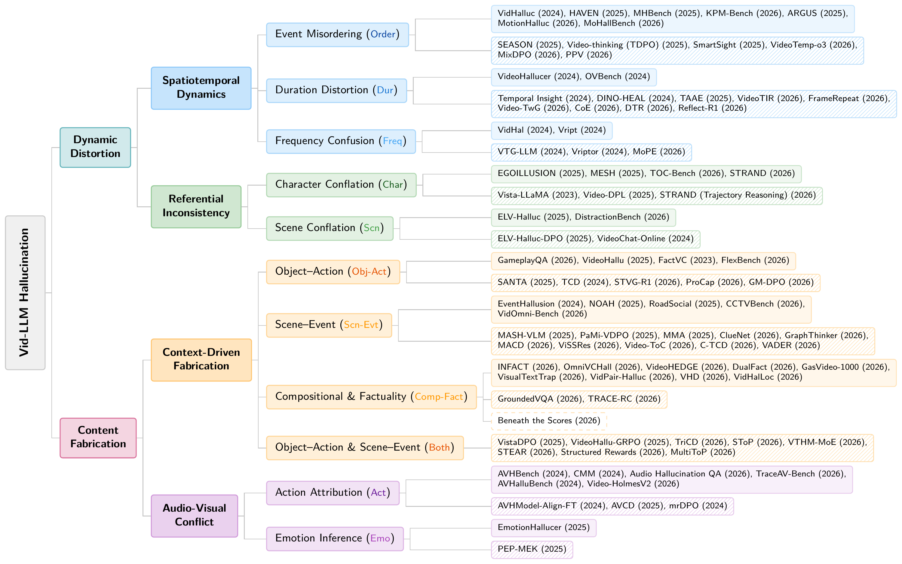

# Awesome-Video-Hallucination [](https://awesome.re)

[](https://arxiv.org/abs/2604.12944) [](https://arxiv.org/abs/2604.12944) [](#evaluation-benchmarks) [](new_papers.md) [](LICENSE) [](https://github.com/hukcc/Awesome-Video-Hallucination/commits/main)

A curated paper list on **hallucination in Video Large Language Models (Vid-LLMs)**, covering **42 benchmarks**, **52 mitigation methods**, and **1 evaluation analysis**. The 95 entries represent 78 distinct papers; a paper may contribute both a benchmark and a method. Updated monthly via arXiv search and manual review.

> 📄 **Survey Paper**: *[Distorted or Fabricated? A Survey on Hallucination in Video LLMs](https://arxiv.org/abs/2604.12944)*

> 🔎 **Interactive Browser**: [Browse 78 papers](https://hukcc.github.io/Awesome-Video-Hallucination/) with source-backed summaries, task tags, combined filters, and table or card views.


## Table of Contents

- [Find Your Papers](#find-your-papers)
- [Taxonomy of Video Hallucinations](#taxonomy-of-video-hallucinations)
- [Evaluation Benchmarks](#evaluation-benchmarks) — 42 benchmarks
- [Mitigation Strategies](#mitigation-strategies) — 52 methods
- [Evaluation Analyses](#evaluation-analyses) — 1 analysis
- [Citation](#citation)
- [Contributing](#contributing)

---

## Latest Updates

- **[2026/10]** Added 7 papers, introduced evaluation analyses, and updated the taxonomy. [Review log](new_papers.md).
- **[2026/09]** Added 2 hallucination mitigation papers.
- **[2026/08]** Added 6 papers and updated the taxonomy.
- **[2026/04]** Our [survey](https://arxiv.org/abs/2604.12944) was accepted to **ACL 2026 Findings**.

---

## Find Your Papers

[Find Benchmarks](https://hukcc.github.io/Awesome-Video-Hallucination/?type=benchmark) · [Training-Free Methods](https://hukcc.github.io/Awesome-Video-Hallucination/?type=mitigation&training=yes) · [With Code](https://hukcc.github.io/Awesome-Video-Hallucination/?resource=code) · [Latest Papers](https://hukcc.github.io/Awesome-Video-Hallucination/?sort=newest) · [Recently Added](https://hukcc.github.io/Awesome-Video-Hallucination/?sort=added)

**Start here:** [Reading guide](https://hukcc.github.io/Awesome-Video-Hallucination/?tab=guide), from the survey to benchmarks, mitigation, and evaluation limits.

<!-- BEGIN TASK INDEX -->

#### Browse by Task

<details>
<summary><b>Task index</b> &middot; 9 topics &middot; 78 papers</summary>

<p><sub>Paper-level task tags. Newest first; links lead to individual contributions below.</sub></p>

<details>
<summary><b>Audio-Visual Understanding</b> (10 papers)</summary>

<p>
<a href="#paper-benchmark--audio-visual-conflict--action-attribution--video-holmesv2--2609-17248">Video-HolmesV2</a> &middot;
<a href="#paper-benchmark--audio-visual-conflict--action-attribution--traceav-bench--2605-07593">TraceAV-Bench</a> &middot;
<a href="#paper-benchmark--audio-visual-conflict--action-attribution--audio-hallucination-qa--2604-23860">Audio Hallucination QA</a> &middot;
<a href="#paper-benchmark--referential-inconsistency--character-conflation--egoillusion--egoillusion-benchmarking-hallucinations-in-egocentric-video-understanding">EGOILLUSION</a> &middot;
<a href="#paper-mitigation--audio-visual-conflict--action-attribution--avcd--2505-20862">AVCD</a> &middot;
<a href="#paper-benchmark--audio-visual-conflict--emotion-inference--emotionhallucer--2505-11405">EmotionHallucer</a> / <a href="#paper-mitigation--audio-visual-conflict--emotion-inference--pep-mek--2505-11405">PEP-MEK</a> &middot;
<a href="#paper-benchmark--audio-visual-conflict--action-attribution--avhbench--2410-18325">AVHBench</a> / <a href="#paper-mitigation--audio-visual-conflict--action-attribution--avhmodel-align-ft--2410-18325">AVHModel-Align-FT</a> &middot;
<a href="#paper-benchmark--audio-visual-conflict--action-attribution--cmm--2410-12787">CMM</a> &middot;
<a href="#paper-mitigation--audio-visual-conflict--action-attribution--mrdpo--2410-06682">mrDPO</a> &middot;
<a href="#paper-benchmark--audio-visual-conflict--action-attribution--avhallubench--2405-13684">AVHalluBench</a>
</p>

</details>

<details>
<summary><b>Hallucination Detection</b> (24 papers)</summary>

<p>
<a href="#paper-analysis--context-driven-fabrication--compositional-and-factuality-hallucination--beneath-the-scores--2609-28991">Beneath the Scores</a> &middot;
<a href="#paper-benchmark--context-driven-fabrication--scene-event-hallucination--vidomni-bench--2609-21521">VidOmni-Bench</a> &middot;
<a href="#paper-benchmark--context-driven-fabrication--compositional-and-factuality-hallucination--vhd--2609-13288">VHD</a> / <a href="#paper-mitigation--context-driven-fabrication--compositional-and-factuality-hallucination--trace-rc--2609-13288">TRACE-RC</a> &middot;
<a href="#paper-benchmark--context-driven-fabrication--compositional-and-factuality-hallucination--vidhalloc--2609-09895">VidHalLoc</a> &middot;
<a href="#paper-mitigation--context-driven-fabrication--compositional-and-factuality-hallucination--groundedvqa--2608-15574">GroundedVQA</a> &middot;
<a href="#paper-benchmark--spatiotemporal-dynamics--event-misordering--mohallbench--2607-01117">MoHallBench</a> &middot;
<a href="#paper-benchmark--context-driven-fabrication--compositional-and-factuality-hallucination--dualfact--2604-25584">DualFact</a> &middot;
<a href="#paper-benchmark--audio-visual-conflict--action-attribution--audio-hallucination-qa--2604-23860">Audio Hallucination QA</a> &middot;
<a href="#paper-benchmark--context-driven-fabrication--compositional-and-factuality-hallucination--infact--2603-11481">INFACT</a> &middot;
<a href="#paper-benchmark--context-driven-fabrication--compositional-and-factuality-hallucination--videohedge--2601-08557">VideoHEDGE</a> &middot;
<a href="#paper-mitigation--spatiotemporal-dynamics--event-misordering--smartsight--2512-18671">SmartSight</a> &middot;
<a href="#paper-benchmark--referential-inconsistency--character-conflation--egoillusion--egoillusion-benchmarking-hallucinations-in-egocentric-video-understanding">EGOILLUSION</a> &middot;
<a href="#paper-benchmark--referential-inconsistency--character-conflation--mesh--2509-08538">MESH</a> &middot;
<a href="#paper-benchmark--referential-inconsistency--scene-conflation--elv-halluc--2508-21496">ELV-Halluc</a> / <a href="#paper-mitigation--referential-inconsistency--scene-conflation--elv-halluc-dpo--2508-21496">ELV-Halluc-DPO</a> &middot;
<a href="#paper-benchmark--spatiotemporal-dynamics--event-misordering--argus--2506-07371">ARGUS</a> &middot;
<a href="#paper-benchmark--audio-visual-conflict--emotion-inference--emotionhallucer--2505-11405">EmotionHallucer</a> / <a href="#paper-mitigation--audio-visual-conflict--emotion-inference--pep-mek--2505-11405">PEP-MEK</a> &middot;
<a href="#paper-benchmark--spatiotemporal-dynamics--event-misordering--haven--2503-19622">HAVEN</a> / <a href="#paper-mitigation--spatiotemporal-dynamics--event-misordering--video-thinking-tdpo--2503-19622">Video-thinking (TDPO)</a> &middot;
<a href="#paper-benchmark--spatiotemporal-dynamics--frequency-confusion--vidhal--2411-16771">VidHal</a> &middot;
<a href="#paper-benchmark--audio-visual-conflict--action-attribution--avhbench--2410-18325">AVHBench</a> / <a href="#paper-mitigation--audio-visual-conflict--action-attribution--avhmodel-align-ft--2410-18325">AVHModel-Align-FT</a> &middot;
<a href="#paper-benchmark--audio-visual-conflict--action-attribution--cmm--2410-12787">CMM</a> &middot;
<a href="#paper-benchmark--spatiotemporal-dynamics--duration-distortion--videohallucer--2406-16338">VideoHallucer</a> &middot;
<a href="#paper-benchmark--spatiotemporal-dynamics--frequency-confusion--vript--2406-06040">Vript</a> / <a href="#paper-mitigation--spatiotemporal-dynamics--frequency-confusion--vriptor--2406-06040">Vriptor</a> &middot;
<a href="#paper-benchmark--audio-visual-conflict--action-attribution--avhallubench--2405-13684">AVHalluBench</a> &middot;
<a href="#paper-benchmark--context-driven-fabrication--object-action-hallucination--factvc--2303-02961">FactVC</a>
</p>

</details>

<details>
<summary><b>Long-Video Understanding</b> (10 papers)</summary>

<p>
<a href="#paper-benchmark--context-driven-fabrication--scene-event-hallucination--vidomni-bench--2609-21521">VidOmni-Bench</a> &middot;
<a href="#paper-benchmark--audio-visual-conflict--action-attribution--video-holmesv2--2609-17248">Video-HolmesV2</a> &middot;
<a href="#paper-mitigation--spatiotemporal-dynamics--duration-distortion--reflect-r1--2606-27922">Reflect-R1</a> &middot;
<a href="#paper-benchmark--referential-inconsistency--scene-conflation--distractionbench--2605-27101">DistractionBench</a> &middot;
<a href="#paper-benchmark--audio-visual-conflict--action-attribution--traceav-bench--2605-07593">TraceAV-Bench</a> &middot;
<a href="#paper-mitigation--spatiotemporal-dynamics--duration-distortion--videotir--2603-25021">VideoTIR</a> &middot;
<a href="#paper-mitigation--spatiotemporal-dynamics--duration-distortion--video-twg--2602-18702">Video-TwG</a> &middot;
<a href="#paper-mitigation--spatiotemporal-dynamics--event-misordering--videotemp-o3--2602-07801">VideoTemp-o3</a> &middot;
<a href="#paper-benchmark--referential-inconsistency--scene-conflation--elv-halluc--2508-21496">ELV-Halluc</a> / <a href="#paper-mitigation--referential-inconsistency--scene-conflation--elv-halluc-dpo--2508-21496">ELV-Halluc-DPO</a> &middot;
<a href="#paper-benchmark--spatiotemporal-dynamics--frequency-confusion--vript--2406-06040">Vript</a> / <a href="#paper-mitigation--spatiotemporal-dynamics--frequency-confusion--vriptor--2406-06040">Vriptor</a>
</p>

</details>

<details>
<summary><b>Motion Understanding</b> (9 papers)</summary>

<p>
<a href="#paper-benchmark--context-driven-fabrication--object-action-hallucination--flexbench--2609-36628">FlexBench</a> / <a href="#paper-mitigation--context-driven-fabrication--object-action-hallucination--gm-dpo--2609-36628">GM-DPO</a> &middot;
<a href="#paper-benchmark--spatiotemporal-dynamics--event-misordering--mohallbench--2607-01117">MoHallBench</a> &middot;
<a href="#paper-benchmark--spatiotemporal-dynamics--event-misordering--motionhalluc--2606-23061">MotionHalluc</a> / <a href="#paper-mitigation--spatiotemporal-dynamics--event-misordering--ppv--2606-23061">PPV</a> &middot;
<a href="#paper-benchmark--spatiotemporal-dynamics--event-misordering--kpm-bench--2602-17768">KPM-Bench</a> / <a href="#paper-mitigation--spatiotemporal-dynamics--frequency-confusion--mope--2602-17768">MoPE</a> &middot;
<a href="#paper-mitigation--spatiotemporal-dynamics--event-misordering--mixdpo--2601-04778">MixDPO</a> &middot;
<a href="#paper-mitigation--context-driven-fabrication--object-action-hallucination--santa--2512-04356">SANTA</a> &middot;
<a href="#paper-benchmark--spatiotemporal-dynamics--event-misordering--mhbench--mhbench-demystifying-motion-hallucination-in-videollms">MHBench</a> &middot;
<a href="#paper-mitigation--context-driven-fabrication--scene-event-hallucination--mash-vlm--2503-15871">MASH-VLM</a> &middot;
<a href="#paper-benchmark--spatiotemporal-dynamics--event-misordering--vidhalluc--2412-03735">VidHalluc</a> / <a href="#paper-mitigation--spatiotemporal-dynamics--duration-distortion--dino-heal--2412-03735">DINO-HEAL</a>
</p>

</details>

<details>
<summary><b>Temporal Grounding</b> (7 papers)</summary>

<p>
<a href="#paper-mitigation--spatiotemporal-dynamics--duration-distortion--video-twg--2602-18702">Video-TwG</a> &middot;
<a href="#paper-mitigation--context-driven-fabrication--scene-event-hallucination--graphthinker--2602-17555">GraphThinker</a> &middot;
<a href="#paper-mitigation--context-driven-fabrication--object-action-hallucination--stvg-r1--2602-11730">STVG-R1</a> &middot;
<a href="#paper-mitigation--spatiotemporal-dynamics--event-misordering--videotemp-o3--2602-07801">VideoTemp-o3</a> &middot;
<a href="#paper-mitigation--spatiotemporal-dynamics--duration-distortion--coe--2601-07761">CoE</a> &middot;
<a href="#paper-mitigation--spatiotemporal-dynamics--frequency-confusion--vtg-llm--2405-13382">VTG-LLM</a> &middot;
<a href="#paper-mitigation--spatiotemporal-dynamics--duration-distortion--temporal-insight--2401-09861">Temporal Insight</a>
</p>

</details>

<details>
<summary><b>Video Captioning</b> (15 papers)</summary>

<p>
<a href="#paper-benchmark--context-driven-fabrication--object-action-hallucination--flexbench--2609-36628">FlexBench</a> / <a href="#paper-mitigation--context-driven-fabrication--object-action-hallucination--gm-dpo--2609-36628">GM-DPO</a> &middot;
<a href="#paper-benchmark--context-driven-fabrication--scene-event-hallucination--vidomni-bench--2609-21521">VidOmni-Bench</a> &middot;
<a href="#paper-benchmark--context-driven-fabrication--compositional-and-factuality-hallucination--vidhalloc--2609-09895">VidHalLoc</a> &middot;
<a href="#paper-mitigation--context-driven-fabrication--object-action-hallucination--procap--2607-21022">ProCap</a> &middot;
<a href="#paper-benchmark--context-driven-fabrication--compositional-and-factuality-hallucination--dualfact--2604-25584">DualFact</a> &middot;
<a href="#paper-mitigation--context-driven-fabrication--both-object-action-scene-event--structured-rewards--2604-01460">Structured Rewards</a> &middot;
<a href="#paper-benchmark--spatiotemporal-dynamics--event-misordering--kpm-bench--2602-17768">KPM-Bench</a> / <a href="#paper-mitigation--spatiotemporal-dynamics--frequency-confusion--mope--2602-17768">MoPE</a> &middot;
<a href="#paper-mitigation--context-driven-fabrication--object-action-hallucination--santa--2512-04356">SANTA</a> &middot;
<a href="#paper-benchmark--context-driven-fabrication--scene-event-hallucination--noah--2511-06475">NOAH</a> &middot;
<a href="#paper-benchmark--spatiotemporal-dynamics--event-misordering--argus--2506-07371">ARGUS</a> &middot;
<a href="#paper-mitigation--context-driven-fabrication--both-object-action-scene-event--vistadpo--2504-13122">VistaDPO</a> &middot;
<a href="#paper-benchmark--spatiotemporal-dynamics--frequency-confusion--vidhal--2411-16771">VidHal</a> &middot;
<a href="#paper-mitigation--audio-visual-conflict--action-attribution--mrdpo--2410-06682">mrDPO</a> &middot;
<a href="#paper-benchmark--spatiotemporal-dynamics--frequency-confusion--vript--2406-06040">Vript</a> / <a href="#paper-mitigation--spatiotemporal-dynamics--frequency-confusion--vriptor--2406-06040">Vriptor</a> &middot;
<a href="#paper-benchmark--context-driven-fabrication--object-action-hallucination--factvc--2303-02961">FactVC</a>
</p>

</details>

<details>
<summary><b>Video QA</b> (41 papers)</summary>

<p>
<a href="#paper-analysis--context-driven-fabrication--compositional-and-factuality-hallucination--beneath-the-scores--2609-28991">Beneath the Scores</a> &middot;
<a href="#paper-benchmark--audio-visual-conflict--action-attribution--video-holmesv2--2609-17248">Video-HolmesV2</a> &middot;
<a href="#paper-benchmark--context-driven-fabrication--compositional-and-factuality-hallucination--vhd--2609-13288">VHD</a> / <a href="#paper-mitigation--context-driven-fabrication--compositional-and-factuality-hallucination--trace-rc--2609-13288">TRACE-RC</a> &middot;
<a href="#paper-benchmark--context-driven-fabrication--compositional-and-factuality-hallucination--vidhalloc--2609-09895">VidHalLoc</a> &middot;
<a href="#paper-benchmark--referential-inconsistency--character-conflation--strand--2609-29607">STRAND</a> / <a href="#paper-mitigation--referential-inconsistency--character-conflation--strand-trajectory-reasoning--2609-29607">STRAND (Trajectory Reasoning)</a> &middot;
<a href="#paper-mitigation--context-driven-fabrication--compositional-and-factuality-hallucination--groundedvqa--2608-15574">GroundedVQA</a> &middot;
<a href="#paper-benchmark--spatiotemporal-dynamics--event-misordering--mohallbench--2607-01117">MoHallBench</a> &middot;
<a href="#paper-benchmark--context-driven-fabrication--compositional-and-factuality-hallucination--vidpair-halluc--2606-31933">VidPair-Halluc</a> &middot;
<a href="#paper-mitigation--spatiotemporal-dynamics--duration-distortion--reflect-r1--2606-27922">Reflect-R1</a> &middot;
<a href="#paper-benchmark--spatiotemporal-dynamics--event-misordering--motionhalluc--2606-23061">MotionHalluc</a> / <a href="#paper-mitigation--spatiotemporal-dynamics--event-misordering--ppv--2606-23061">PPV</a> &middot;
<a href="#paper-benchmark--referential-inconsistency--scene-conflation--distractionbench--2605-27101">DistractionBench</a> &middot;
<a href="#paper-benchmark--referential-inconsistency--character-conflation--toc-bench--2605-09904">TOC-Bench</a> &middot;
<a href="#paper-benchmark--audio-visual-conflict--action-attribution--traceav-bench--2605-07593">TraceAV-Bench</a> &middot;
<a href="#paper-benchmark--audio-visual-conflict--action-attribution--audio-hallucination-qa--2604-23860">Audio Hallucination QA</a> &middot;
<a href="#paper-benchmark--context-driven-fabrication--scene-event-hallucination--cctvbench--2604-20460">CCTVBench</a> / <a href="#paper-mitigation--context-driven-fabrication--scene-event-hallucination--c-tcd--2604-20460">C-TCD</a> &middot;
<a href="#paper-benchmark--context-driven-fabrication--compositional-and-factuality-hallucination--visualtexttrap--2604-17375">VisualTextTrap</a> / <a href="#paper-mitigation--context-driven-fabrication--both-object-action-scene-event--vthm-moe--2604-17375">VTHM-MoE</a> &middot;
<a href="#paper-mitigation--context-driven-fabrication--both-object-action-scene-event--structured-rewards--2604-01460">Structured Rewards</a> &middot;
<a href="#paper-mitigation--spatiotemporal-dynamics--duration-distortion--videotir--2603-25021">VideoTIR</a> &middot;
<a href="#paper-benchmark--context-driven-fabrication--object-action-hallucination--gameplayqa--2603-24329">GameplayQA</a> &middot;
<a href="#paper-mitigation--spatiotemporal-dynamics--duration-distortion--framerepeat--2603-16256">FrameRepeat</a> &middot;
<a href="#paper-mitigation--context-driven-fabrication--scene-event-hallucination--cluenet--2603-15008">ClueNet</a> &middot;
<a href="#paper-benchmark--context-driven-fabrication--compositional-and-factuality-hallucination--infact--2603-11481">INFACT</a> &middot;
<a href="#paper-mitigation--spatiotemporal-dynamics--duration-distortion--video-twg--2602-18702">Video-TwG</a> &middot;
<a href="#paper-benchmark--spatiotemporal-dynamics--event-misordering--kpm-bench--2602-17768">KPM-Bench</a> / <a href="#paper-mitigation--spatiotemporal-dynamics--frequency-confusion--mope--2602-17768">MoPE</a> &middot;
<a href="#paper-mitigation--spatiotemporal-dynamics--event-misordering--videotemp-o3--2602-07801">VideoTemp-o3</a> &middot;
<a href="#paper-mitigation--context-driven-fabrication--scene-event-hallucination--stscd--2601-22574">ViSSRes</a> &middot;
<a href="#paper-benchmark--context-driven-fabrication--compositional-and-factuality-hallucination--videohedge--2601-08557">VideoHEDGE</a> &middot;
<a href="#paper-mitigation--referential-inconsistency--character-conflation--videoplr--2511-18463">Video-DPL</a> &middot;
<a href="#paper-benchmark--context-driven-fabrication--scene-event-hallucination--noah--2511-06475">NOAH</a> &middot;
<a href="#paper-benchmark--referential-inconsistency--character-conflation--egoillusion--egoillusion-benchmarking-hallucinations-in-egocentric-video-understanding">EGOILLUSION</a> &middot;
<a href="#paper-benchmark--referential-inconsistency--character-conflation--mesh--2509-08538">MESH</a> &middot;
<a href="#paper-benchmark--context-driven-fabrication--object-action-hallucination--videohallu--2505-01481">VideoHallu</a> / <a href="#paper-mitigation--context-driven-fabrication--both-object-action-scene-event--videohallu-grpo--2505-01481">VideoHallu-GRPO</a> &middot;
<a href="#paper-mitigation--context-driven-fabrication--both-object-action-scene-event--vistadpo--2504-13122">VistaDPO</a> &middot;
<a href="#paper-benchmark--spatiotemporal-dynamics--event-misordering--mhbench--mhbench-demystifying-motion-hallucination-in-videollms">MHBench</a> &middot;
<a href="#paper-benchmark--context-driven-fabrication--scene-event-hallucination--roadsocial--2503-21459">RoadSocial</a> &middot;
<a href="#paper-benchmark--spatiotemporal-dynamics--event-misordering--haven--2503-19622">HAVEN</a> / <a href="#paper-mitigation--spatiotemporal-dynamics--event-misordering--video-thinking-tdpo--2503-19622">Video-thinking (TDPO)</a> &middot;
<a href="#paper-mitigation--context-driven-fabrication--scene-event-hallucination--mash-vlm--2503-15871">MASH-VLM</a> &middot;
<a href="#paper-benchmark--spatiotemporal-dynamics--duration-distortion--ovbench--2501-00584">OVBench</a> / <a href="#paper-mitigation--referential-inconsistency--scene-conflation--videochat-online--2501-00584">VideoChat-Online</a> &middot;
<a href="#paper-benchmark--spatiotemporal-dynamics--event-misordering--vidhalluc--2412-03735">VidHalluc</a> / <a href="#paper-mitigation--spatiotemporal-dynamics--duration-distortion--dino-heal--2412-03735">DINO-HEAL</a> &middot;
<a href="#paper-benchmark--spatiotemporal-dynamics--duration-distortion--videohallucer--2406-16338">VideoHallucer</a> &middot;
<a href="#paper-mitigation--referential-inconsistency--character-conflation--vista-llama--2312-08870">Vista-LLaMA</a>
</p>

</details>

<details>
<summary><b>Video Reasoning</b> (26 papers)</summary>

<p>
<a href="#paper-analysis--context-driven-fabrication--compositional-and-factuality-hallucination--beneath-the-scores--2609-28991">Beneath the Scores</a> &middot;
<a href="#paper-benchmark--referential-inconsistency--character-conflation--strand--2609-29607">STRAND</a> / <a href="#paper-mitigation--referential-inconsistency--character-conflation--strand-trajectory-reasoning--2609-29607">STRAND (Trajectory Reasoning)</a> &middot;
<a href="#paper-mitigation--context-driven-fabrication--scene-event-hallucination--vader--2608-08622">VADER</a> &middot;
<a href="#paper-benchmark--context-driven-fabrication--compositional-and-factuality-hallucination--vidpair-halluc--2606-31933">VidPair-Halluc</a> &middot;
<a href="#paper-benchmark--referential-inconsistency--character-conflation--toc-bench--2605-09904">TOC-Bench</a> &middot;
<a href="#paper-benchmark--context-driven-fabrication--scene-event-hallucination--cctvbench--2604-20460">CCTVBench</a> / <a href="#paper-mitigation--context-driven-fabrication--scene-event-hallucination--c-tcd--2604-20460">C-TCD</a> &middot;
<a href="#paper-mitigation--context-driven-fabrication--scene-event-hallucination--video-toc--2604-20473">Video-ToC</a> &middot;
<a href="#paper-benchmark--context-driven-fabrication--compositional-and-factuality-hallucination--gasvideo-1000--2604-17873">GasVideo-1000</a> &middot;
<a href="#paper-mitigation--context-driven-fabrication--both-object-action-scene-event--stear--2604-03045">STEAR</a> &middot;
<a href="#paper-mitigation--context-driven-fabrication--both-object-action-scene-event--structured-rewards--2604-01460">Structured Rewards</a> &middot;
<a href="#paper-benchmark--context-driven-fabrication--object-action-hallucination--gameplayqa--2603-24329">GameplayQA</a> &middot;
<a href="#paper-mitigation--spatiotemporal-dynamics--duration-distortion--framerepeat--2603-16256">FrameRepeat</a> &middot;
<a href="#paper-mitigation--context-driven-fabrication--scene-event-hallucination--cluenet--2603-15008">ClueNet</a> &middot;
<a href="#paper-benchmark--context-driven-fabrication--compositional-and-factuality-hallucination--infact--2603-11481">INFACT</a> &middot;
<a href="#paper-mitigation--context-driven-fabrication--scene-event-hallucination--graphthinker--2602-17555">GraphThinker</a> &middot;
<a href="#paper-benchmark--context-driven-fabrication--compositional-and-factuality-hallucination--omnivchall--2602-00559">OmniVCHall</a> / <a href="#paper-mitigation--context-driven-fabrication--both-object-action-scene-event--tricd--2602-00559">TriCD</a> &middot;
<a href="#paper-mitigation--spatiotemporal-dynamics--duration-distortion--coe--2601-07761">CoE</a> &middot;
<a href="#paper-mitigation--spatiotemporal-dynamics--event-misordering--mixdpo--2601-04778">MixDPO</a> &middot;
<a href="#paper-mitigation--spatiotemporal-dynamics--event-misordering--season--2512-04643">SEASON</a> &middot;
<a href="#paper-mitigation--referential-inconsistency--character-conflation--videoplr--2511-18463">Video-DPL</a> &middot;
<a href="#paper-benchmark--context-driven-fabrication--scene-event-hallucination--noah--2511-06475">NOAH</a> &middot;
<a href="#paper-benchmark--context-driven-fabrication--object-action-hallucination--videohallu--2505-01481">VideoHallu</a> / <a href="#paper-mitigation--context-driven-fabrication--both-object-action-scene-event--videohallu-grpo--2505-01481">VideoHallu-GRPO</a> &middot;
<a href="#paper-benchmark--spatiotemporal-dynamics--event-misordering--haven--2503-19622">HAVEN</a> / <a href="#paper-mitigation--spatiotemporal-dynamics--event-misordering--video-thinking-tdpo--2503-19622">Video-thinking (TDPO)</a> &middot;
<a href="#paper-benchmark--spatiotemporal-dynamics--event-misordering--vidhalluc--2412-03735">VidHalluc</a> / <a href="#paper-mitigation--spatiotemporal-dynamics--duration-distortion--dino-heal--2412-03735">DINO-HEAL</a> &middot;
<a href="#paper-benchmark--spatiotemporal-dynamics--frequency-confusion--vidhal--2411-16771">VidHal</a> &middot;
<a href="#paper-benchmark--context-driven-fabrication--scene-event-hallucination--eventhallusion--2409-16597">EventHallusion</a> / <a href="#paper-mitigation--context-driven-fabrication--object-action-hallucination--tcd--2409-16597">TCD</a>
</p>

</details>

<details>
<summary><b>Video Understanding</b> (21 papers)</summary>

<p>
<a href="#paper-mitigation--context-driven-fabrication--scene-event-hallucination--vader--2608-08622">VADER</a> &middot;
<a href="#paper-mitigation--context-driven-fabrication--both-object-action-scene-event--multitop--2606-11792">MultiToP</a> &middot;
<a href="#paper-mitigation--context-driven-fabrication--both-object-action-scene-event--stop--2604-20937">SToP</a> &middot;
<a href="#paper-mitigation--context-driven-fabrication--scene-event-hallucination--video-toc--2604-20473">Video-ToC</a> &middot;
<a href="#paper-benchmark--context-driven-fabrication--compositional-and-factuality-hallucination--gasvideo-1000--2604-17873">GasVideo-1000</a> &middot;
<a href="#paper-benchmark--context-driven-fabrication--compositional-and-factuality-hallucination--visualtexttrap--2604-17375">VisualTextTrap</a> / <a href="#paper-mitigation--context-driven-fabrication--both-object-action-scene-event--vthm-moe--2604-17375">VTHM-MoE</a> &middot;
<a href="#paper-mitigation--spatiotemporal-dynamics--duration-distortion--dtr--2604-12582">DTR</a> &middot;
<a href="#paper-mitigation--context-driven-fabrication--both-object-action-scene-event--stear--2604-03045">STEAR</a> &middot;
<a href="#paper-mitigation--context-driven-fabrication--object-action-hallucination--stvg-r1--2602-11730">STVG-R1</a> &middot;
<a href="#paper-mitigation--context-driven-fabrication--scene-event-hallucination--macd--2602-01740">MACD</a> &middot;
<a href="#paper-benchmark--context-driven-fabrication--compositional-and-factuality-hallucination--omnivchall--2602-00559">OmniVCHall</a> / <a href="#paper-mitigation--context-driven-fabrication--both-object-action-scene-event--tricd--2602-00559">TriCD</a> &middot;
<a href="#paper-mitigation--context-driven-fabrication--scene-event-hallucination--stscd--2601-22574">ViSSRes</a> &middot;
<a href="#paper-mitigation--spatiotemporal-dynamics--event-misordering--smartsight--2512-18671">SmartSight</a> &middot;
<a href="#paper-mitigation--spatiotemporal-dynamics--event-misordering--season--2512-04643">SEASON</a> &middot;
<a href="#paper-mitigation--context-driven-fabrication--scene-event-hallucination--mma--hallucination-reduction-in-video-language-models-via-hierarchical-multimodal-consistency">MMA</a> &middot;
<a href="#paper-mitigation--spatiotemporal-dynamics--duration-distortion--taae--2505-12826">TAAE</a> &middot;
<a href="#paper-mitigation--context-driven-fabrication--scene-event-hallucination--pami-vdpo--2504-05810">PaMi-VDPO</a> &middot;
<a href="#paper-benchmark--context-driven-fabrication--scene-event-hallucination--roadsocial--2503-21459">RoadSocial</a> &middot;
<a href="#paper-benchmark--spatiotemporal-dynamics--duration-distortion--ovbench--2501-00584">OVBench</a> / <a href="#paper-mitigation--referential-inconsistency--scene-conflation--videochat-online--2501-00584">VideoChat-Online</a> &middot;
<a href="#paper-benchmark--context-driven-fabrication--scene-event-hallucination--eventhallusion--2409-16597">EventHallusion</a> / <a href="#paper-mitigation--context-driven-fabrication--object-action-hallucination--tcd--2409-16597">TCD</a> &middot;
<a href="#paper-mitigation--referential-inconsistency--character-conflation--vista-llama--2312-08870">Vista-LLaMA</a>
</p>

</details>

</details>

<!-- END TASK INDEX -->

---

## Taxonomy of Video Hallucinations

<details>
<summary><b>View the full taxonomy tree</b> (95 contributions)</summary>

<p align="center">
    <a href="imgs/fig2_taxonomy.png"></a>
    <br>
    <em>Mechanism-driven taxonomy of Vid-LLM hallucinations. Solid fill = benchmarks; striped fill = mitigation methods; dashed outline = evaluation analyses. Placement indicates a primary indexing category, not exclusive coverage.</em>
    <br>
    <sub>Generated from <a href="data/papers.json">paper data</a> using the <a href="figs/taxonomy_tree.tex">LaTeX tree source</a>.</sub>
</p>

</details>

---

<!-- BEGIN PAPER LIST -->

## Evaluation Benchmarks

> [!NOTE]
> Newest first within each subtype. **Date** = first arXiv submission, or publisher issue date when no arXiv record is used; venue years may differ. [Sources and review notes](data/paper_details.json).

<details>
<summary><b>Resource badge legend</b></summary>

<p> = Project Page<br>
 = GitHub Repository<br>
 = Hugging Face Dataset<br>
 = Kaggle Dataset<br>
 = Leaderboard<br>
<code>-</code> = No verified resource link</p>

</details>

### 🔵 Spatiotemporal Dynamics Benchmarks (Dynamic Distortion)

<details open>
<summary><b>Event Misordering</b> (7 entries)</summary>

<table width="100%">
  <thead>
    <tr>
      <th width="53%" align="left">Paper</th>
      <th width="13%" align="center">Benchmark</th>
      <th width="16%" align="center">Venue / Date</th>
      <th width="18%" align="center">Resources</th>
    </tr>
  </thead>
  <tbody>
    <tr>
      <td align="left"><a id="paper-benchmark--spatiotemporal-dynamics--event-misordering--mohallbench--2607-01117"></a><b><a href="https://arxiv.org/abs/2607.01117">MoHallBench: A Benchmark for Motion Hallucination in Video Large Language Models</a></b><br>
        <sub>Probes motion hallucinations caused by prior knowledge, sequential inference, and visual similarity through several question formats.</sub></td>
      <td align="center"><b>MoHallBench</b></td>
      <td align="center">arXiv 2026<br><sub>07/2026</sub></td>
      <td align="center">-</td>
    </tr>
    <tr>
      <td align="left"><a id="paper-benchmark--spatiotemporal-dynamics--event-misordering--motionhalluc--2606-23061"></a><b><a href="https://arxiv.org/abs/2606.23061">MotionHalluc: Diagnosing Kinematic Hallucinations in Fine-Grained Motion Reasoning</a></b><br>
        <sub>Diagnoses fine-grained motion hallucinations involving direction, attribution, and temporal kinematics, separating distinct failures in interpreting physical movement.</sub><br>
        <sub><a href="#paper-mitigation--spatiotemporal-dynamics--event-misordering--ppv--2606-23061">Related method: PPV</a></sub></td>
      <td align="center"><b>MotionHalluc</b></td>
      <td align="center">arXiv 2026<br><sub>06/2026</sub></td>
      <td align="center"><a href="https://huggingface.co/datasets/motionhalluc/MotionHalluc"></a></td>
    </tr>
    <tr>
      <td align="left"><a id="paper-benchmark--spatiotemporal-dynamics--event-misordering--kpm-bench--2602-17768"></a><b><a href="https://arxiv.org/abs/2602.17768">KPM-Bench: A Kinematic Parsing Motion Benchmark for Fine-grained Motion-centric Video Understanding</a></b><br>
        <sub>Evaluates fine-grained limb motion through video captioning and question answering, using kinematic parsing to assess motion descriptions.</sub><br>
        <sub><a href="#paper-mitigation--spatiotemporal-dynamics--frequency-confusion--mope--2602-17768">Related method: MoPE</a></sub></td>
      <td align="center"><b>KPM-Bench</b></td>
      <td align="center">arXiv 2026<br><sub>02/2026</sub></td>
      <td align="center">-</td>
    </tr>
    <tr>
      <td align="left"><a id="paper-benchmark--spatiotemporal-dynamics--event-misordering--argus--2506-07371"></a><b><a href="https://arxiv.org/abs/2506.07371">ARGUS: Hallucination and Omission Evaluation in Video-LLMs</a></b><br>
        <sub>Measures both fabricated content and missing information in free-form video captions against human-written reference descriptions.</sub></td>
      <td align="center"><b>ARGUS</b></td>
      <td align="center">ICCV 2025<br><sub>06/2025</sub></td>
      <td align="center"><a href="https://ruchitrawal.github.io/argus"></a> <a href="https://github.com/JARVVVIS/argus"></a></td>
    </tr>
    <tr>
      <td align="left"><a id="paper-benchmark--spatiotemporal-dynamics--event-misordering--mhbench--mhbench-demystifying-motion-hallucination-in-videollms"></a><b><a href="https://ojs.aaai.org/index.php/AAAI/article/view/32463">MHBench: Demystifying Motion Hallucination in VideoLLMs</a></b><br>
        <sub>Tests motion hallucinations using original actions, actions with reversed meanings, and incomplete actions that challenge static visual cues.</sub></td>
      <td align="center"><b>MHBench</b></td>
      <td align="center">AAAI 2025<br><sub>04/2025</sub></td>
      <td align="center"><a href="https://github.com/xzhouzeng/MHBench"></a></td>
    </tr>
    <tr>
      <td align="left"><a id="paper-benchmark--spatiotemporal-dynamics--event-misordering--haven--2503-19622"></a><b><a href="https://arxiv.org/abs/2503.19622">Exploring Hallucination of Large Multimodal Models in Video Understanding: Benchmark, Analysis and Mitigation</a></b><br>
        <sub>Diagnoses video hallucinations by crossing hallucination causes, object-scene-event aspects, and question formats to expose distinct failures in video understanding.</sub><br>
        <sub><a href="#paper-mitigation--spatiotemporal-dynamics--event-misordering--video-thinking-tdpo--2503-19622">Related method: Video-thinking (TDPO)</a></sub></td>
      <td align="center"><b>HAVEN</b></td>
      <td align="center">arXiv 2025<br><sub>03/2025</sub></td>
      <td align="center"><a href="https://github.com/Hongcheng-Gao/HAVEN"></a></td>
    </tr>
    <tr>
      <td align="left"><a id="paper-benchmark--spatiotemporal-dynamics--event-misordering--vidhalluc--2412-03735"></a><b><a href="https://arxiv.org/abs/2412.03735">VidHalluc: Evaluating Temporal Hallucinations in Multimodal Large Language Models for Video Understanding</a></b><br>
        <sub>Evaluates hallucinations about actions, temporal order, and scene transitions through video questions, caption generation, and event sorting.</sub><br>
        <sub><a href="#paper-mitigation--spatiotemporal-dynamics--duration-distortion--dino-heal--2412-03735">Related method: DINO-HEAL</a></sub></td>
      <td align="center"><b>VidHalluc</b></td>
      <td align="center">CVPR 2025<br><sub>12/2024</sub></td>
      <td align="center"><a href="https://people-robots.github.io/vidhalluc"></a> <a href="https://github.com/CyL97/VidHalluc"></a></td>
    </tr>
  </tbody>
</table>

</details>

<details open>
<summary><b>Duration Distortion</b> (2 entries)</summary>

<table width="100%">
  <thead>
    <tr>
      <th width="53%" align="left">Paper</th>
      <th width="13%" align="center">Benchmark</th>
      <th width="16%" align="center">Venue / Date</th>
      <th width="18%" align="center">Resources</th>
    </tr>
  </thead>
  <tbody>
    <tr>
      <td align="left"><a id="paper-benchmark--spatiotemporal-dynamics--duration-distortion--ovbench--2501-00584"></a><b><a href="https://arxiv.org/abs/2501.00584">Online Video Understanding: OVBench and VideoChat-Online</a></b><br>
        <sub>Evaluates streaming-video question answering across online perception, memory, and reasoning tasks; its scope extends beyond hallucination-specific evaluation.</sub><br>
        <sub><a href="#paper-mitigation--referential-inconsistency--scene-conflation--videochat-online--2501-00584">Related method: VideoChat-Online</a></sub></td>
      <td align="center"><b>OVBench</b></td>
      <td align="center">CVPR 2025<br><sub>12/2024</sub></td>
      <td align="center"><a href="https://videochat-online.github.io/"></a> <a href="https://github.com/mcg-nju/videochat-online"></a></td>
    </tr>
    <tr>
      <td align="left"><a id="paper-benchmark--spatiotemporal-dynamics--duration-distortion--videohallucer--2406-16338"></a><b><a href="https://arxiv.org/abs/2406.16338">VideoHallucer: Evaluating Intrinsic and Extrinsic Hallucinations in Large Video-Language Models</a></b><br>
        <sub>Uses adversarial question pairs to distinguish hallucinations about visible objects and temporal relations from unsupported external information.</sub></td>
      <td align="center"><b>VideoHallucer</b></td>
      <td align="center">arXiv 2024<br><sub>06/2024</sub></td>
      <td align="center"><a href="https://github.com/patrick-tssn/VideoHallucer"></a></td>
    </tr>
  </tbody>
</table>

</details>

<details open>
<summary><b>Frequency Confusion</b> (2 entries)</summary>

<table width="100%">
  <thead>
    <tr>
      <th width="53%" align="left">Paper</th>
      <th width="13%" align="center">Benchmark</th>
      <th width="16%" align="center">Venue / Date</th>
      <th width="18%" align="center">Resources</th>
    </tr>
  </thead>
  <tbody>
    <tr>
      <td align="left"><a id="paper-benchmark--spatiotemporal-dynamics--frequency-confusion--vidhal--2411-16771"></a><b><a href="https://arxiv.org/abs/2411.16771">VidHal: Benchmarking Temporal Hallucinations in Vision LLMs</a></b><br>
        <sub>Evaluates temporal hallucinations by asking models to distinguish and rank video captions with different degrees of factual distortion.</sub></td>
      <td align="center"><b>VidHal</b></td>
      <td align="center">TMLR 2026<br><sub>11/2024</sub></td>
      <td align="center"><a href="https://github.com/Lookuz/VidHal"></a></td>
    </tr>
    <tr>
      <td align="left"><a id="paper-benchmark--spatiotemporal-dynamics--frequency-confusion--vript--2406-06040"></a><b><a href="https://arxiv.org/abs/2406.06040">Vript: A Video Is Worth Thousands of Words</a></b><br>
        <sub>Provides dense video descriptions and Vript-Hard evaluations targeting hallucinated captions, information retrieval, and temporal ordering of video events.</sub><br>
        <sub><a href="#paper-mitigation--spatiotemporal-dynamics--frequency-confusion--vriptor--2406-06040">Related method: Vriptor</a></sub></td>
      <td align="center"><b>Vript</b></td>
      <td align="center">NeurIPS 2024<br><sub>06/2024</sub></td>
      <td align="center"><a href="https://github.com/mutonix/Vript"></a></td>
    </tr>
  </tbody>
</table>

</details>

### 🟢 Referential Inconsistency Benchmarks (Dynamic Distortion)

<details open>
<summary><b>Character Conflation</b> (4 entries)</summary>

<table width="100%">
  <thead>
    <tr>
      <th width="53%" align="left">Paper</th>
      <th width="13%" align="center">Benchmark</th>
      <th width="16%" align="center">Venue / Date</th>
      <th width="18%" align="center">Resources</th>
    </tr>
  </thead>
  <tbody>
    <tr>
      <td align="left"><a id="paper-benchmark--referential-inconsistency--character-conflation--strand--2609-29607"></a><b><a href="https://arxiv.org/abs/2609.29607">STRAND: Benchmarking and Improving Object-Centric Spatio-Temporal Monitoring in Video Large Language Models</a></b><br>
        <sub>Evaluates object-state changes, identity persistence, and relational reasoning, requiring answers to satisfy jointly grounded spatiotemporal prerequisites.</sub><br>
        <sub><a href="#paper-mitigation--referential-inconsistency--character-conflation--strand-trajectory-reasoning--2609-29607">Related method: STRAND (Trajectory Reasoning)</a></sub></td>
      <td align="center"><b>STRAND</b></td>
      <td align="center">arXiv 2026<br><sub>08/2026</sub></td>
      <td align="center"><a href="https://nguyentthong.github.io/strand/"></a> <a href="https://github.com/nguyentthong/video_hallucination"></a></td>
    </tr>
    <tr>
      <td align="left"><a id="paper-benchmark--referential-inconsistency--character-conflation--toc-bench--2605-09904"></a><b><a href="https://arxiv.org/abs/2605.09904">TOC-Bench: A Temporal Object Consistency Benchmark for Video Large Language Models</a></b><br>
        <sub>Tests object identity, state, and continuity with trajectory-grounded questions designed to require temporally ordered visual evidence.</sub></td>
      <td align="center"><b>TOC-Bench</b></td>
      <td align="center">arXiv 2026<br><sub>05/2026</sub></td>
      <td align="center"><a href="https://github.com/cjzcjz666/toc_bench"></a></td>
    </tr>
    <tr>
      <td align="left"><a id="paper-benchmark--referential-inconsistency--character-conflation--egoillusion--egoillusion-benchmarking-hallucinations-in-egocentric-video-understanding"></a><b><a href="https://aclanthology.org/2025.emnlp-main.1446/">EGOILLUSION: Benchmarking Hallucinations in Egocentric Video Understanding</a></b><br>
        <sub>Tests hallucinations in first-person videos through human-annotated open and closed questions about visual and auditory evidence.</sub></td>
      <td align="center"><b>EGOILLUSION</b></td>
      <td align="center">EMNLP 2025<br><sub>11/2025</sub></td>
      <td align="center"><a href="https://sites.google.com/view/egoillusion-demo/home"></a></td>
    </tr>
    <tr>
      <td align="left"><a id="paper-benchmark--referential-inconsistency--character-conflation--mesh--2509-08538"></a><b><a href="https://arxiv.org/abs/2509.08538">MESH -- Understanding Videos Like Human: Measuring Hallucinations in Large Video Models</a></b><br>
        <sub>Uses hierarchical questions and plausible distractors to expose hallucinations about objects, attributes, and subject-action relations across video segments.</sub></td>
      <td align="center"><b>MESH</b></td>
      <td align="center">ACM MM 2025<br><sub>09/2025</sub></td>
      <td align="center"><a href="https://github.com/HCYANG2000/MESH-Benchmark"></a></td>
    </tr>
  </tbody>
</table>

</details>

<details open>
<summary><b>Scene Conflation</b> (2 entries)</summary>

<table width="100%">
  <thead>
    <tr>
      <th width="53%" align="left">Paper</th>
      <th width="13%" align="center">Benchmark</th>
      <th width="16%" align="center">Venue / Date</th>
      <th width="18%" align="center">Resources</th>
    </tr>
  </thead>
  <tbody>
    <tr>
      <td align="left"><a id="paper-benchmark--referential-inconsistency--scene-conflation--distractionbench--2605-27101"></a><b><a href="https://arxiv.org/abs/2605.27101">Pop-Up Distractions Reveal Bag-of-Events Behavior in Video Large Language Models</a></b><br>
        <sub>Inserts advertising distractors into long videos to test whether models conflate subjects and events from unrelated segments.</sub></td>
      <td align="center"><b>DistractionBench</b></td>
      <td align="center">arXiv 2026<br><sub>05/2026</sub></td>
      <td align="center"><a href="https://github.com/lab-flair/video-llm-boe"></a> <a href="https://huggingface.co/datasets/lab-flair/VideoLLM-BoE"></a></td>
    </tr>
    <tr>
      <td align="left"><a id="paper-benchmark--referential-inconsistency--scene-conflation--elv-halluc--2508-21496"></a><b><a href="https://arxiv.org/abs/2508.21496">ELV-Halluc: Benchmarking Semantic Aggregation Hallucinations in Long Video Understanding</a></b><br>
        <sub>Tests hallucinations from semantic aggregation in long videos, where models can incorrectly combine information across separate video segments.</sub><br>
        <sub><a href="#paper-mitigation--referential-inconsistency--scene-conflation--elv-halluc-dpo--2508-21496">Related method: ELV-Halluc-DPO</a></sub></td>
      <td align="center"><b>ELV-Halluc</b></td>
      <td align="center">arXiv 2025<br><sub>08/2025</sub></td>
      <td align="center"><a href="https://github.com/hlsv02/ELV-Halluc"></a></td>
    </tr>
  </tbody>
</table>

</details>

### 🟠 Context-Driven Fabrication Benchmarks (Content Fabrication)

<details open>
<summary><b>Object-Action Hallucination</b> (4 entries)</summary>

<table width="100%">
  <thead>
    <tr>
      <th width="53%" align="left">Paper</th>
      <th width="13%" align="center">Benchmark</th>
      <th width="16%" align="center">Venue / Date</th>
      <th width="18%" align="center">Resources</th>
    </tr>
  </thead>
  <tbody>
    <tr>
      <td align="left"><a id="paper-benchmark--context-driven-fabrication--object-action-hallucination--flexbench--2609-36628"></a><b><a href="https://arxiv.org/abs/2609.36628">Beyond Binary Preferences: Graded Preference Optimization for Limb-Motion Captioning</a></b><br>
        <sub>Evaluates person-specific limb-motion captions across shots, distinguishing omissions from fabricated or incorrect actions through graded physical alignment.</sub><br>
        <sub><a href="#paper-mitigation--context-driven-fabrication--object-action-hallucination--gm-dpo--2609-36628">Related method: GM-DPO</a></sub></td>
      <td align="center"><b>FlexBench</b></td>
      <td align="center">arXiv 2026<br><sub>09/2026</sub></td>
      <td align="center">-</td>
    </tr>
    <tr>
      <td align="left"><a id="paper-benchmark--context-driven-fabrication--object-action-hallucination--gameplayqa--2603-24329"></a><b><a href="https://arxiv.org/abs/2603.24329">GameplayQA: A Benchmarking Framework for Decision-Dense POV-Synced Multi-Video Understanding of 3D Virtual Agents</a></b><br>
        <sub>Uses synchronized multiplayer gameplay views and structured distractors to test agent identity, role attribution, and grounded reasoning.</sub></td>
      <td align="center"><b>GameplayQA</b></td>
      <td align="center">ACL 2026<br><sub>03/2026</sub></td>
      <td align="center"><a href="https://hats-ict.github.io/gameplayqa/"></a> <a href="https://github.com/HATS-ICT/GameplayQA"></a> <a href="https://huggingface.co/datasets/wangyz1999/GameplayQA"></a></td>
    </tr>
    <tr>
      <td align="left"><a id="paper-benchmark--context-driven-fabrication--object-action-hallucination--videohallu--2505-01481"></a><b><a href="https://arxiv.org/abs/2505.01481">VideoHallu: Evaluating and Mitigating Multi-modal Hallucinations on Synthetic Video Understanding</a></b><br>
        <sub>Tests prior-driven hallucinations using synthetic videos that violate physical or logical expectations, challenging models to follow observed evidence.</sub><br>
        <sub><a href="#paper-mitigation--context-driven-fabrication--both-object-action-scene-event--videohallu-grpo--2505-01481">Related method: VideoHallu-GRPO</a></sub></td>
      <td align="center"><b>VideoHallu</b></td>
      <td align="center">NeurIPS 2025<br><sub>05/2025</sub></td>
      <td align="center"><a href="https://github.com/zli12321/VideoHallu"></a></td>
    </tr>
    <tr>
      <td align="left"><a id="paper-benchmark--context-driven-fabrication--object-action-hallucination--factvc--2303-02961"></a><b><a href="https://arxiv.org/abs/2303.02961">Models See Hallucinations: Evaluating the Factuality in Video Captioning</a></b><br>
        <sub>Studies factual errors in video captions and introduces a weakly supervised factuality metric with human-annotated evaluation data.</sub></td>
      <td align="center"><b>FactVC</b></td>
      <td align="center">EMNLP 2023<br><sub>03/2023</sub></td>
      <td align="center"><a href="https://github.com/PKULiuHui/FactVC"></a></td>
    </tr>
  </tbody>
</table>

</details>

<details open>
<summary><b>Scene-Event Hallucination</b> (5 entries)</summary>

<table width="100%">
  <thead>
    <tr>
      <th width="53%" align="left">Paper</th>
      <th width="13%" align="center">Benchmark</th>
      <th width="16%" align="center">Venue / Date</th>
      <th width="18%" align="center">Resources</th>
    </tr>
  </thead>
  <tbody>
    <tr>
      <td align="left"><a id="paper-benchmark--context-driven-fabrication--scene-event-hallucination--vidomni-bench--2609-21521"></a><b><a href="https://arxiv.org/abs/2609.21521">VidOmni-Bench: A Benchmark for Fine-Grained Video Understanding via Spatio-Temporal Event Verification across Complexity and Duration</a></b><br>
        <sub>Tests whether models can verify individual events in dense video captions, using human-checked incorrect descriptions as hard negatives.</sub></td>
      <td align="center"><b>VidOmni-Bench</b></td>
      <td align="center">arXiv 2026<br><sub>09/2026</sub></td>
      <td align="center">-</td>
    </tr>
    <tr>
      <td align="left"><a id="paper-benchmark--context-driven-fabrication--scene-event-hallucination--cctvbench--2604-20460"></a><b><a href="https://arxiv.org/abs/2604.20460">CCTVBench: Contrastive Consistency Traffic VideoQA Benchmark for Multimodal LLMs</a></b><br>
        <sub>Tests consistent traffic-hazard judgments using real accident videos paired with counterfactual counterparts that alter the evidence for an accident.</sub><br>
        <sub><a href="#paper-mitigation--context-driven-fabrication--scene-event-hallucination--c-tcd--2604-20460">Related method: C-TCD</a></sub></td>
      <td align="center"><b>CCTVBench</b></td>
      <td align="center">arXiv 2026<br><sub>04/2026</sub></td>
      <td align="center">-</td>
    </tr>
    <tr>
      <td align="left"><a id="paper-benchmark--context-driven-fabrication--scene-event-hallucination--noah--2511-06475"></a><b><a href="https://arxiv.org/abs/2511.06475">NOAH: Benchmarking Narrative Prior driven Hallucination and Omission in Video Large Language Models</a></b><br>
        <sub>Inserts unrelated clips into videos to measure narrative-prior hallucinations and omissions through captioning and question-answering tasks.</sub></td>
      <td align="center"><b>NOAH</b></td>
      <td align="center">arXiv 2025<br><sub>11/2025</sub></td>
      <td align="center"><a href="https://anonymous550520.github.io/"></a> <a href="https://github.com/anonymous550520/NOAH"></a></td>
    </tr>
    <tr>
      <td align="left"><a id="paper-benchmark--context-driven-fabrication--scene-event-hallucination--roadsocial--2503-21459"></a><b><a href="https://arxiv.org/abs/2503.21459">RoadSocial: A Diverse VideoQA Dataset and Benchmark for Road Event Understanding from Social Video Narratives</a></b><br>
        <sub>Provides diverse social-media road videos and question-answer pairs for evaluating road-event understanding across viewpoints and geographic settings.</sub></td>
      <td align="center"><b>RoadSocial</b></td>
      <td align="center">CVPR 2025<br><sub>03/2025</sub></td>
      <td align="center"><a href="https://roadsocial.github.io/"></a> <a href="https://github.com/roadsocial/roadsocial"></a></td>
    </tr>
    <tr>
      <td align="left"><a id="paper-benchmark--context-driven-fabrication--scene-event-hallucination--eventhallusion--2409-16597"></a><b><a href="https://arxiv.org/abs/2409.16597">EventHallusion: Diagnosing Event Hallucinations in Video LLMs</a></b><br>
        <sub>Diagnoses event hallucinations driven by language priors and visual biases, testing whether answers reflect events actually present in videos.</sub><br>
        <sub><a href="#paper-mitigation--context-driven-fabrication--object-action-hallucination--tcd--2409-16597">Related method: TCD</a></sub></td>
      <td align="center"><b>EventHallusion</b></td>
      <td align="center">arXiv 2024<br><sub>09/2024</sub></td>
      <td align="center"><a href="https://github.com/Stevetich/EventHallusion"></a></td>
    </tr>
  </tbody>
</table>

</details>

<details open>
<summary><b>Compositional and Factuality Hallucination</b> (9 entries)</summary>

<table width="100%">
  <thead>
    <tr>
      <th width="53%" align="left">Paper</th>
      <th width="13%" align="center">Benchmark</th>
      <th width="16%" align="center">Venue / Date</th>
      <th width="18%" align="center">Resources</th>
    </tr>
  </thead>
  <tbody>
    <tr>
      <td align="left"><a id="paper-benchmark--context-driven-fabrication--compositional-and-factuality-hallucination--vhd--2609-13288"></a><b><a href="https://arxiv.org/abs/2609.13288">Target-Checked Reliability Score Refinement for Video Question Answering</a></b><br>
        <sub>Provides controlled video-question examples of confident but incorrect answers for diagnosing hallucinations and evaluating the reliability of confidence estimates.</sub><br>
        <sub><a href="#paper-mitigation--context-driven-fabrication--compositional-and-factuality-hallucination--trace-rc--2609-13288">Related method: TRACE-RC</a></sub></td>
      <td align="center"><b>VHD</b></td>
      <td align="center">arXiv 2026<br><sub>09/2026</sub></td>
      <td align="center"><a href="https://github.com/sydney-machine-learning/video-hallucination-diagnosis"></a> <a href="https://www.kaggle.com/datasets/mlopssss/video-hallucination-diagnosis"></a></td>
    </tr>
    <tr>
      <td align="left"><a id="paper-benchmark--context-driven-fabrication--compositional-and-factuality-hallucination--vidhalloc--2609-09895"></a><b><a href="https://arxiv.org/abs/2609.09895">Can We Trust Video Hallucination Detectors? VidHalLoc for Evaluating the Evaluators</a></b><br>
        <sub>Compares hallucination detectors on adversarial video questions and captions, with a shared protocol spanning ontology and dynamic errors.</sub></td>
      <td align="center"><b>VidHalLoc</b></td>
      <td align="center">arXiv 2026<br><sub>09/2026</sub></td>
      <td align="center">-</td>
    </tr>
    <tr>
      <td align="left"><a id="paper-benchmark--context-driven-fabrication--compositional-and-factuality-hallucination--vidpair-halluc--2606-31933"></a><b><a href="https://arxiv.org/abs/2606.31933">No Place to Hide: Benchmarking Video Hallucination with Background-Controlled Pairs</a></b><br>
        <sub>Uses adversarial video pairs with similar backgrounds but different foreground events to isolate spatial and temporal hallucinations.</sub></td>
      <td align="center"><b>VidPair-Halluc</b></td>
      <td align="center">ECCV 2026<br><sub>06/2026</sub></td>
      <td align="center"><a href="https://jethrojames.github.io/VidPair-Halluc/"></a></td>
    </tr>
    <tr>
      <td align="left"><a id="paper-benchmark--context-driven-fabrication--compositional-and-factuality-hallucination--dualfact--2604-25584"></a><b><a href="https://arxiv.org/abs/2604.25584">DualFact+: A Multimodal Fact Verification Framework for Procedural Video Understanding</a></b><br>
        <sub>Evaluates procedural-caption factuality at conceptual and grounded argument levels, using either textual references or direct video evidence.</sub></td>
      <td align="center"><b>DualFact</b></td>
      <td align="center">ACL 2026 Findings<br><sub>04/2026</sub></td>
      <td align="center">-</td>
    </tr>
    <tr>
      <td align="left"><a id="paper-benchmark--context-driven-fabrication--compositional-and-factuality-hallucination--gasvideo-1000--2604-17873"></a><b><a href="https://arxiv.org/abs/2604.17873">Spatiotemporal Sycophancy: Negation-Based Gaslighting in Video Large Language Models</a></b><br>
        <sub>Tests whether misleading conversational feedback causes video models to abandon correct judgments and invent unsupported spatiotemporal explanations.</sub></td>
      <td align="center"><b>GasVideo-1000</b></td>
      <td align="center">arXiv 2026<br><sub>04/2026</sub></td>
      <td align="center"><a href="https://pengkun-jiao.github.io/GasVideo-1000"></a></td>
    </tr>
    <tr>
      <td align="left"><a id="paper-benchmark--context-driven-fabrication--compositional-and-factuality-hallucination--visualtexttrap--2604-17375"></a><b><a href="https://arxiv.org/abs/2604.17375">When Text Hijacks Vision: Benchmarking and Mitigating Text Overlay-Induced Hallucination in Vision Language Models</a></b><br>
        <sub>Tests whether misleading text overlays cause video models to contradict visual evidence when answering questions about the depicted content.</sub><br>
        <sub><a href="#paper-mitigation--context-driven-fabrication--both-object-action-scene-event--vthm-moe--2604-17375">Related method: VTHM-MoE</a></sub></td>
      <td align="center"><b>VisualTextTrap</b></td>
      <td align="center">arXiv 2026<br><sub>04/2026</sub></td>
      <td align="center">-</td>
    </tr>
    <tr>
      <td align="left"><a id="paper-benchmark--context-driven-fabrication--compositional-and-factuality-hallucination--infact--2603-11481"></a><b><a href="https://arxiv.org/abs/2603.11481">INFACT: A Diagnostic Benchmark for Induced Faithfulness and Factuality Hallucinations in Video-LLMs</a></b><br>
        <sub>Separates faithfulness from factuality errors in video answers and probes robustness to degraded visuals, corrupted evidence, and temporal interventions.</sub></td>
      <td align="center"><b>INFACT</b></td>
      <td align="center">arXiv 2026<br><sub>03/2026</sub></td>
      <td align="center">-</td>
    </tr>
    <tr>
      <td align="left"><a id="paper-benchmark--context-driven-fabrication--compositional-and-factuality-hallucination--omnivchall--2602-00559"></a><b><a href="https://arxiv.org/abs/2602.00559">Learning to Decode Against Compositional Hallucination in Video Multimodal Large Language Models</a></b><br>
        <sub>Benchmarks isolated and compositional hallucinations across spatial and temporal dimensions, probing failures involving multiple interacting types of video evidence.</sub><br>
        <sub><a href="#paper-mitigation--context-driven-fabrication--both-object-action-scene-event--tricd--2602-00559">Related method: TriCD</a></sub></td>
      <td align="center"><b>OmniVCHall</b></td>
      <td align="center">arXiv 2026<br><sub>01/2026</sub></td>
      <td align="center"><a href="https://github.com/BMRETURN/OmniVCHall"></a></td>
    </tr>
    <tr>
      <td align="left"><a id="paper-benchmark--context-driven-fabrication--compositional-and-factuality-hallucination--videohedge--2601-08557"></a><b><a href="https://arxiv.org/abs/2601.08557">VideoHEDGE: Entropy-Based Hallucination Detection for Video-VLMs via Semantic Clustering and Spatiotemporal Perturbations</a></b><br>
        <sub>Estimates answer reliability by clustering responses to clean and perturbed videos and measuring semantic uncertainty across those responses.</sub></td>
      <td align="center"><b>VideoHEDGE</b></td>
      <td align="center">arXiv 2026<br><sub>01/2026</sub></td>
      <td align="center"><a href="https://github.com/Simula/HEDGE"></a></td>
    </tr>
  </tbody>
</table>

</details>

### 🟣 Audio-Visual Conflict Benchmarks (Content Fabrication)

<details open>
<summary><b>Action Attribution</b> (6 entries)</summary>

<table width="100%">
  <thead>
    <tr>
      <th width="53%" align="left">Paper</th>
      <th width="13%" align="center">Benchmark</th>
      <th width="16%" align="center">Venue / Date</th>
      <th width="18%" align="center">Resources</th>
    </tr>
  </thead>
  <tbody>
    <tr>
      <td align="left"><a id="paper-benchmark--audio-visual-conflict--action-attribution--video-holmesv2--2609-17248"></a><b><a href="https://arxiv.org/abs/2609.17248">Video-HolmesV2: Can MLLMs Reason with Spatio-Temporal Audio-Visual Evidence in Long Videos?</a></b><br>
        <sub>Requires long-video answers to cite precise audio-visual evidence, using evidence-aware scoring to penalize guessing and fabricated support.</sub></td>
      <td align="center"><b>Video-HolmesV2</b></td>
      <td align="center">ECCV 2026<br><sub>09/2026</sub></td>
      <td align="center">-</td>
    </tr>
    <tr>
      <td align="left"><a id="paper-benchmark--audio-visual-conflict--action-attribution--traceav-bench--2605-07593"></a><b><a href="https://arxiv.org/abs/2605.07593">TraceAV-Bench: Benchmarking Multi-Hop Trajectory Reasoning over Long Audio-Visual Videos</a></b><br>
        <sub>Tests multi-hop reasoning and hallucination robustness using explicit evidence trajectories distributed across long audio-visual recordings.</sub></td>
      <td align="center"><b>TraceAV-Bench</b></td>
      <td align="center">arXiv 2026<br><sub>05/2026</sub></td>
      <td align="center">-</td>
    </tr>
    <tr>
      <td align="left"><a id="paper-benchmark--audio-visual-conflict--action-attribution--audio-hallucination-qa--2604-23860"></a><b><a href="https://arxiv.org/abs/2604.23860">Exploring Audio Hallucination in Egocentric Video Understanding</a></b><br>
        <sub>Probes imagined foreground and background sounds in egocentric videos through questions targeting visible but inaudible events.</sub></td>
      <td align="center"><b>Audio Hallucination QA</b></td>
      <td align="center">ICASSP 2026<br><sub>04/2026</sub></td>
      <td align="center">-</td>
    </tr>
    <tr>
      <td align="left"><a id="paper-benchmark--audio-visual-conflict--action-attribution--avhbench--2410-18325"></a><b><a href="https://arxiv.org/abs/2410.18325">AVHBench: A Cross-Modal Hallucination Benchmark for Audio-Visual Large Language Models</a></b><br>
        <sub>Evaluates audio-visual hallucinations, cross-modal matching, and reasoning through tasks that distinguish auditory evidence from visible video content.</sub><br>
        <sub><a href="#paper-mitigation--audio-visual-conflict--action-attribution--avhmodel-align-ft--2410-18325">Related method: AVHModel-Align-FT</a></sub></td>
      <td align="center"><b>AVHBench</b></td>
      <td align="center">ICLR 2025<br><sub>10/2024</sub></td>
      <td align="center"><a href="https://github.com/kaist-ami/AVHBench"></a></td>
    </tr>
    <tr>
      <td align="left"><a id="paper-benchmark--audio-visual-conflict--action-attribution--cmm--2410-12787"></a><b><a href="https://arxiv.org/abs/2410.12787">The Curse of Multi-Modalities: Evaluating Hallucinations of Large Multimodal Models across Language, Visual, and Audio</a></b><br>
        <sub>Investigates how unimodal priors and misleading correlations between language, vision, and audio cause multimodal hallucinations.</sub></td>
      <td align="center"><b>CMM</b></td>
      <td align="center">arXiv 2024<br><sub>10/2024</sub></td>
      <td align="center"><a href="https://github.com/DAMO-NLP-SG/CMM"></a></td>
    </tr>
    <tr>
      <td align="left"><a id="paper-benchmark--audio-visual-conflict--action-attribution--avhallubench--2405-13684"></a><b><a href="https://arxiv.org/abs/2405.13684">CrossCheckGPT: Universal Hallucination Ranking for Multimodal Foundation Models</a></b><br>
        <sub>Provides an audio-visual hallucination benchmark with human judgments for evaluating whether generated descriptions remain consistent with multimodal evidence.</sub></td>
      <td align="center"><b>AVHalluBench</b></td>
      <td align="center">arXiv 2024<br><sub>05/2024</sub></td>
      <td align="center"><a href="https://huggingface.co/datasets/typhoon-ai/avhallubench"></a> <a href="https://huggingface.co/spaces/typhoon-ai/multimodal-hallucination-leaderboard"></a></td>
    </tr>
  </tbody>
</table>

</details>

<details open>
<summary><b>Emotion Inference</b> (1 entry)</summary>

<table width="100%">
  <thead>
    <tr>
      <th width="53%" align="left">Paper</th>
      <th width="13%" align="center">Benchmark</th>
      <th width="16%" align="center">Venue / Date</th>
      <th width="18%" align="center">Resources</th>
    </tr>
  </thead>
  <tbody>
    <tr>
      <td align="left"><a id="paper-benchmark--audio-visual-conflict--emotion-inference--emotionhallucer--2505-11405"></a><b><a href="https://arxiv.org/abs/2505.11405">EmotionHallucer: Evaluating Emotion Hallucinations in Multimodal Large Language Models</a></b><br>
        <sub>Evaluates emotion hallucinations in psychological knowledge and multimodal perception through adversarial questions about emotional cues and their interpretation.</sub><br>
        <sub><a href="#paper-mitigation--audio-visual-conflict--emotion-inference--pep-mek--2505-11405">Related method: PEP-MEK</a></sub></td>
      <td align="center"><b>EmotionHallucer</b></td>
      <td align="center">arXiv 2025<br><sub>05/2025</sub></td>
      <td align="center"><a href="https://github.com/xxtars/EmotionHallucer"></a></td>
    </tr>
  </tbody>
</table>

</details>

[Back to task index](#browse-by-task)

---

## Mitigation Strategies

> [!NOTE]
> **Training-free:** ✔︎ No additional parameter learning; ✘ Training required, including auxiliary modules with a frozen backbone. Dates use first publication; newest first within each subtype.

### 🔵 Spatiotemporal Dynamics Mitigation (Dynamic Distortion)

<details open>
<summary><b>Event Misordering</b> (6 entries)</summary>

<table width="100%">
  <thead>
    <tr>
      <th width="46%" align="left">Paper</th>
      <th width="13%" align="center">Method</th>
      <th width="14%" align="center">Venue / Date</th>
      <th width="9%" align="center">Training-Free</th>
      <th width="18%" align="center">Resources</th>
    </tr>
  </thead>
  <tbody>
    <tr>
      <td align="left"><a id="paper-mitigation--spatiotemporal-dynamics--event-misordering--ppv--2606-23061"></a><b><a href="https://arxiv.org/abs/2606.23061">MotionHalluc: Diagnosing Kinematic Hallucinations in Fine-Grained Motion Reasoning</a></b><br>
        <sub>Injects measured physical-motion evidence into video reasoning to check kinematic claims, without training or modifying the underlying video model.</sub><br>
        <sub><a href="#paper-benchmark--spatiotemporal-dynamics--event-misordering--motionhalluc--2606-23061">Related benchmark: MotionHalluc</a></sub></td>
      <td align="center"><b>PPV</b></td>
      <td align="center">arXiv 2026<br><sub>06/2026</sub></td>
      <td align="center"><span title="Training-free: Yes">✔︎</span></td>
      <td align="center"><a href="https://huggingface.co/datasets/motionhalluc/MotionHalluc"></a></td>
    </tr>
    <tr>
      <td align="left"><a id="paper-mitigation--spatiotemporal-dynamics--event-misordering--videotemp-o3--2602-07801"></a><b><a href="https://arxiv.org/abs/2602.07801">VideoTemp-o3: Harmonizing Temporal Grounding and Video Understanding in Agentic Thinking-with-Videos</a></b><br>
        <sub>Jointly trains temporal localization and video answering so an agent can inspect relevant clips and revise inaccurate grounding.</sub></td>
      <td align="center"><b>VideoTemp-o3</b></td>
      <td align="center">ICML 2026<br><sub>02/2026</sub></td>
      <td align="center"><span title="Training-free: No">✘</span></td>
      <td align="center"><a href="https://liuwq-bit.github.io/VideoTemp-o3/"></a> <a href="https://github.com/Kwai-Keye/VideoTemp-o3"></a></td>
    </tr>
    <tr>
      <td align="left"><a id="paper-mitigation--spatiotemporal-dynamics--event-misordering--mixdpo--2601-04778"></a><b><a href="https://arxiv.org/abs/2601.04778">CounterVid: Counterfactual Video Generation for Mitigating Action and Temporal Hallucinations in Video-Language Models</a></b><br>
        <sub>Creates counterfactual action videos and jointly optimizes visual and textual preferences to reduce action and temporal-order hallucinations.</sub></td>
      <td align="center"><b>MixDPO</b></td>
      <td align="center">EMNLP 2026<br><sub>01/2026</sub></td>
      <td align="center"><span title="Training-free: No">✘</span></td>
      <td align="center">-</td>
    </tr>
    <tr>
      <td align="left"><a id="paper-mitigation--spatiotemporal-dynamics--event-misordering--smartsight--2512-18671"></a><b><a href="https://arxiv.org/abs/2512.18671">SmartSight: Mitigating Hallucination in Video-LLMs Without Compromising Video Understanding via Temporal Attention Collapse</a></b><br>
        <sub>Selects among sampled responses using temporal attention collapse and terminates unreliable generations when visual attention vanishes.</sub></td>
      <td align="center"><b>SmartSight</b></td>
      <td align="center">AAAI 2026<br><sub>12/2025</sub></td>
      <td align="center"><span title="Training-free: Yes">✔︎</span></td>
      <td align="center">-</td>
    </tr>
    <tr>
      <td align="left"><a id="paper-mitigation--spatiotemporal-dynamics--event-misordering--season--2512-04643"></a><b><a href="https://arxiv.org/abs/2512.04643">SEASON: Mitigating Temporal Hallucination in Video Large Language Models via Self-Diagnostic Contrastive Decoding</a></b><br>
        <sub>Diagnoses hallucination tendencies token by token and adaptively contrasts temporal and spatial negatives without additional training.</sub></td>
      <td align="center"><b>SEASON</b></td>
      <td align="center">arXiv 2025<br><sub>12/2025</sub></td>
      <td align="center"><span title="Training-free: Yes">✔︎</span></td>
      <td align="center">-</td>
    </tr>
    <tr>
      <td align="left"><a id="paper-mitigation--spatiotemporal-dynamics--event-misordering--video-thinking-tdpo--2503-19622"></a><b><a href="https://arxiv.org/abs/2503.19622">Exploring Hallucination of Large Multimodal Models in Video Understanding: Benchmark, Analysis and Mitigation</a></b><br>
        <sub>Combines supervised reasoning fine-tuning with thinking-based direct preference optimization, giving fabricated reasoning stronger feedback to improve factual grounding.</sub><br>
        <sub><a href="#paper-benchmark--spatiotemporal-dynamics--event-misordering--haven--2503-19622">Related benchmark: HAVEN</a></sub></td>
      <td align="center"><b>Video-thinking (TDPO)</b></td>
      <td align="center">arXiv 2025<br><sub>03/2025</sub></td>
      <td align="center"><span title="Training-free: No">✘</span></td>
      <td align="center"><a href="https://github.com/Hongcheng-Gao/HAVEN"></a></td>
    </tr>
  </tbody>
</table>

</details>

<details open>
<summary><b>Duration Distortion</b> (9 entries)</summary>

<table width="100%">
  <thead>
    <tr>
      <th width="46%" align="left">Paper</th>
      <th width="13%" align="center">Method</th>
      <th width="14%" align="center">Venue / Date</th>
      <th width="9%" align="center">Training-Free</th>
      <th width="18%" align="center">Resources</th>
    </tr>
  </thead>
  <tbody>
    <tr>
      <td align="left"><a id="paper-mitigation--spatiotemporal-dynamics--duration-distortion--reflect-r1--2606-27922"></a><b><a href="https://arxiv.org/abs/2606.27922">Reflect-R1: Evidence-Driven Reflection for Self-Correction in Long Video Understanding</a></b><br>
        <sub>Retrieves visual evidence to verify and arbitrate long-video answers, with separate reinforcement-learning objectives for each reflection stage.</sub></td>
      <td align="center"><b>Reflect-R1</b></td>
      <td align="center">ECCV 2026<br><sub>06/2026</sub></td>
      <td align="center"><span title="Training-free: No">✘</span></td>
      <td align="center"><a href="https://github.com/ShuimuChen-hyq/Reflect-R1"></a> <a href="https://huggingface.co/datasets/CSDDSFSFSAFSAF/Reflect-R1-data"></a></td>
    </tr>
    <tr>
      <td align="left"><a id="paper-mitigation--spatiotemporal-dynamics--duration-distortion--dtr--2604-12582"></a><b><a href="https://arxiv.org/abs/2604.12582">Relaxing Anchor-Frame Dominance for Mitigating Hallucinations in Video Large Language Models</a></b><br>
        <sub>Rebalances decoder attention toward under-attended frames without training, changing visual encoding, or introducing auxiliary models.</sub></td>
      <td align="center"><b>DTR</b></td>
      <td align="center">arXiv 2026<br><sub>04/2026</sub></td>
      <td align="center"><span title="Training-free: Yes">✔︎</span></td>
      <td align="center">-</td>
    </tr>
    <tr>
      <td align="left"><a id="paper-mitigation--spatiotemporal-dynamics--duration-distortion--videotir--2603-25021"></a><b><a href="https://arxiv.org/abs/2603.25021">VideoTIR: Accurate Understanding for Long Videos with Efficient Tool-Integrated Reasoning</a></b><br>
        <sub>Uses reinforcement learning to coordinate retrieval of video clips, images, and regions for efficient, evidence-grounded long-video answers.</sub></td>
      <td align="center"><b>VideoTIR</b></td>
      <td align="center">arXiv 2026<br><sub>03/2026</sub></td>
      <td align="center"><span title="Training-free: No">✘</span></td>
      <td align="center">-</td>
    </tr>
    <tr>
      <td align="left"><a id="paper-mitigation--spatiotemporal-dynamics--duration-distortion--framerepeat--2603-16256"></a><b><a href="https://arxiv.org/abs/2603.16256">When Thinking Hurts: Mitigating Visual Forgetting in Video Reasoning via Frame Repetition</a></b><br>
        <sub>Trains a lightweight scoring module to repeat useful frames during reasoning and counter drift away from visual evidence.</sub></td>
      <td align="center"><b>FrameRepeat</b></td>
      <td align="center">arXiv 2026<br><sub>03/2026</sub></td>
      <td align="center"><span title="Training-free: No">✘</span></td>
      <td align="center">-</td>
    </tr>
    <tr>
      <td align="left"><a id="paper-mitigation--spatiotemporal-dynamics--duration-distortion--video-twg--2602-18702"></a><b><a href="https://arxiv.org/abs/2602.18702">Think with Grounding: Curriculum Reinforced Reasoning with Video Grounding for Long Video Understanding</a></b><br>
        <sub>Trains long-video models to interleave reasoning with on-demand temporal grounding through a staged reinforcement-learning curriculum.</sub></td>
      <td align="center"><b>Video-TwG</b></td>
      <td align="center">arXiv 2026<br><sub>02/2026</sub></td>
      <td align="center"><span title="Training-free: No">✘</span></td>
      <td align="center">-</td>
    </tr>
    <tr>
      <td align="left"><a id="paper-mitigation--spatiotemporal-dynamics--duration-distortion--coe--2601-07761"></a><b><a href="https://arxiv.org/abs/2601.07761">Video Evidence to Reasoning Efficient Video Understanding via Explicit Evidence Grounding</a></b><br>
        <sub>Extracts compact, question-relevant visual evidence and uses reinforcement learning to anchor reasoning to the selected temporal evidence.</sub></td>
      <td align="center"><b>CoE</b></td>
      <td align="center">ICME 2026<br><sub>01/2026</sub></td>
      <td align="center"><span title="Training-free: No">✘</span></td>
      <td align="center">-</td>
    </tr>
    <tr>
      <td align="left"><a id="paper-mitigation--spatiotemporal-dynamics--duration-distortion--taae--2505-12826"></a><b><a href="https://arxiv.org/abs/2505.12826">Mitigating Hallucination in VideoLLMs via Temporal-Aware Activation Engineering</a></b><br>
        <sub>Uses temporal variation to identify and intervene in hallucination-sensitive model activations without further fine-tuning the language model.</sub></td>
      <td align="center"><b>TAAE</b></td>
      <td align="center">arXiv 2025<br><sub>05/2025</sub></td>
      <td align="center"><span title="Training-free: No">✘</span></td>
      <td align="center">-</td>
    </tr>
    <tr>
      <td align="left"><a id="paper-mitigation--spatiotemporal-dynamics--duration-distortion--dino-heal--2412-03735"></a><b><a href="https://arxiv.org/abs/2412.03735">VidHalluc: Evaluating Temporal Hallucinations in Multimodal Large Language Models for Video Understanding</a></b><br>
        <sub>Uses DINOv2 saliency to reweight visual features during inference, emphasizing informative regions without additional training of the video model.</sub><br>
        <sub><a href="#paper-benchmark--spatiotemporal-dynamics--event-misordering--vidhalluc--2412-03735">Related benchmark: VidHalluc</a></sub></td>
      <td align="center"><b>DINO-HEAL</b></td>
      <td align="center">CVPR 2025<br><sub>12/2024</sub></td>
      <td align="center"><span title="Training-free: Yes">✔︎</span></td>
      <td align="center"><a href="https://people-robots.github.io/vidhalluc"></a> <a href="https://github.com/CyL97/VidHalluc"></a></td>
    </tr>
    <tr>
      <td align="left"><a id="paper-mitigation--spatiotemporal-dynamics--duration-distortion--temporal-insight--2401-09861"></a><b><a href="https://arxiv.org/abs/2401.09861">Temporal Insight Enhancement: Mitigating Temporal Hallucination in Multimodal Large Language Models</a></b><br>
        <sub>Decomposes event queries into characteristic actions and uses visual-language models to estimate timestamps for temporally grounded responses.</sub></td>
      <td align="center"><b>Temporal Insight</b></td>
      <td align="center">ICPR 2024<br><sub>01/2024</sub></td>
      <td align="center"><span title="Training-free: Yes">✔︎</span></td>
      <td align="center">-</td>
    </tr>
  </tbody>
</table>

</details>

<details open>
<summary><b>Frequency Confusion</b> (3 entries)</summary>

<table width="100%">
  <thead>
    <tr>
      <th width="46%" align="left">Paper</th>
      <th width="13%" align="center">Method</th>
      <th width="14%" align="center">Venue / Date</th>
      <th width="9%" align="center">Training-Free</th>
      <th width="18%" align="center">Resources</th>
    </tr>
  </thead>
  <tbody>
    <tr>
      <td align="left"><a id="paper-mitigation--spatiotemporal-dynamics--frequency-confusion--mope--2602-17768"></a><b><a href="https://arxiv.org/abs/2602.17768">KPM-Bench: A Kinematic Parsing Motion Benchmark for Fine-grained Motion-centric Video Understanding</a></b><br>
        <sub>Uses kinematic parsing of motion descriptions as a reinforcement-learning reward to improve fine-grained video captioning and reduce motion hallucinations.</sub><br>
        <sub><a href="#paper-benchmark--spatiotemporal-dynamics--event-misordering--kpm-bench--2602-17768">Related benchmark: KPM-Bench</a></sub></td>
      <td align="center"><b>MoPE</b></td>
      <td align="center">arXiv 2026<br><sub>02/2026</sub></td>
      <td align="center"><span title="Training-free: No">✘</span></td>
      <td align="center">-</td>
    </tr>
    <tr>
      <td align="left"><a id="paper-mitigation--spatiotemporal-dynamics--frequency-confusion--vriptor--2406-06040"></a><b><a href="https://arxiv.org/abs/2406.06040">Vript: A Video Is Worth Thousands of Words</a></b><br>
        <sub>Trains a video captioning model on densely annotated videos to generate detailed descriptions of visual content and unfolding events.</sub><br>
        <sub><a href="#paper-benchmark--spatiotemporal-dynamics--frequency-confusion--vript--2406-06040">Related benchmark: Vript</a></sub></td>
      <td align="center"><b>Vriptor</b></td>
      <td align="center">NeurIPS 2024<br><sub>06/2024</sub></td>
      <td align="center"><span title="Training-free: No">✘</span></td>
      <td align="center"><a href="https://github.com/mutonix/Vript"></a></td>
    </tr>
    <tr>
      <td align="left"><a id="paper-mitigation--spatiotemporal-dynamics--frequency-confusion--vtg-llm--2405-13382"></a><b><a href="https://arxiv.org/abs/2405.13382">VTG-LLM: Integrating Timestamp Knowledge into Video LLMs for Enhanced Video Temporal Grounding</a></b><br>
        <sub>Improves event timestamp localization by adding explicit time information to video tokens and using slot-based visual compression.</sub></td>
      <td align="center"><b>VTG-LLM</b></td>
      <td align="center">AAAI 2025<br><sub>05/2024</sub></td>
      <td align="center"><span title="Training-free: No">✘</span></td>
      <td align="center"><a href="https://github.com/gyxxyg/VTG-LLM"></a></td>
    </tr>
  </tbody>
</table>

</details>

### 🟢 Referential Inconsistency Mitigation (Dynamic Distortion)

<details open>
<summary><b>Character Conflation</b> (3 entries)</summary>

<table width="100%">
  <thead>
    <tr>
      <th width="46%" align="left">Paper</th>
      <th width="13%" align="center">Method</th>
      <th width="14%" align="center">Venue / Date</th>
      <th width="9%" align="center">Training-Free</th>
      <th width="18%" align="center">Resources</th>
    </tr>
  </thead>
  <tbody>
    <tr>
      <td align="left"><a id="paper-mitigation--referential-inconsistency--character-conflation--strand-trajectory-reasoning--2609-29607"></a><b><a href="https://arxiv.org/abs/2609.29607">STRAND: Benchmarking and Improving Object-Centric Spatio-Temporal Monitoring in Video Large Language Models</a></b><br>
        <sub>Combines structured visual trajectories with symbolic aggregation to answer object-centric spatiotemporal questions using a fixed video-language model.</sub><br>
        <sub><a href="#paper-benchmark--referential-inconsistency--character-conflation--strand--2609-29607">Related benchmark: STRAND</a></sub></td>
      <td align="center"><b>STRAND (Trajectory Reasoning)</b></td>
      <td align="center">arXiv 2026<br><sub>08/2026</sub></td>
      <td align="center"><span title="Training-free: Yes">✔︎</span></td>
      <td align="center"><a href="https://nguyentthong.github.io/strand/"></a> <a href="https://github.com/nguyentthong/video_hallucination"></a></td>
    </tr>
    <tr>
      <td align="left"><a id="paper-mitigation--referential-inconsistency--character-conflation--videoplr--2511-18463"></a><b><a href="https://arxiv.org/abs/2511.18463">Decoupling Perception from Reasoning for Hallucination-Resistant Video Understanding</a></b><br>
        <sub>Separates timestamped perceptual evidence from reasoning and uses factuality-aware process rewards to train hallucination-resistant video models.</sub></td>
      <td align="center"><b>Video-DPL</b></td>
      <td align="center">arXiv 2025<br><sub>11/2025</sub></td>
      <td align="center"><span title="Training-free: No">✘</span></td>
      <td align="center"><a href="https://github.com/BoweiPu/VideoPLR"></a></td>
    </tr>
    <tr>
      <td align="left"><a id="paper-mitigation--referential-inconsistency--character-conflation--vista-llama--2312-08870"></a><b><a href="https://arxiv.org/abs/2312.08870">Vista-LLaMA: Reducing Hallucination in Video Language Models via Equal Distance to Visual Tokens</a></b><br>
        <sub>Changes visual-text attention and sequential frame projection to preserve the influence of video evidence during open-ended answer generation.</sub></td>
      <td align="center"><b>Vista-LLaMA</b></td>
      <td align="center">CVPR 2024<br><sub>12/2023</sub></td>
      <td align="center"><span title="Training-free: No">✘</span></td>
      <td align="center"><a href="https://jinxxian.github.io/Vista-LLaMA/"></a> <a href="https://github.com/Flowerfan/VistaLLaMA"></a></td>
    </tr>
  </tbody>
</table>

</details>

<details open>
<summary><b>Scene Conflation</b> (2 entries)</summary>

<table width="100%">
  <thead>
    <tr>
      <th width="46%" align="left">Paper</th>
      <th width="13%" align="center">Method</th>
      <th width="14%" align="center">Venue / Date</th>
      <th width="9%" align="center">Training-Free</th>
      <th width="18%" align="center">Resources</th>
    </tr>
  </thead>
  <tbody>
    <tr>
      <td align="left"><a id="paper-mitigation--referential-inconsistency--scene-conflation--elv-halluc-dpo--2508-21496"></a><b><a href="https://arxiv.org/abs/2508.21496">ELV-Halluc: Benchmarking Semantic Aggregation Hallucinations in Long Video Understanding</a></b><br>
        <sub>Trains on adversarial preference pairs to reduce long-video hallucinations caused by incorrectly combining semantic information across video segments.</sub><br>
        <sub><a href="#paper-benchmark--referential-inconsistency--scene-conflation--elv-halluc--2508-21496">Related benchmark: ELV-Halluc</a></sub></td>
      <td align="center"><b>ELV-Halluc-DPO</b></td>
      <td align="center">arXiv 2025<br><sub>08/2025</sub></td>
      <td align="center"><span title="Training-free: No">✘</span></td>
      <td align="center"><a href="https://github.com/hlsv02/ELV-Halluc"></a></td>
    </tr>
    <tr>
      <td align="left"><a id="paper-mitigation--referential-inconsistency--scene-conflation--videochat-online--2501-00584"></a><b><a href="https://arxiv.org/abs/2501.00584">Online Video Understanding: OVBench and VideoChat-Online</a></b><br>
        <sub>Combines pyramid memory with offline-to-online instruction training to support streaming-video perception, memory, and reasoning over continuously arriving frames.</sub><br>
        <sub><a href="#paper-benchmark--spatiotemporal-dynamics--duration-distortion--ovbench--2501-00584">Related benchmark: OVBench</a></sub></td>
      <td align="center"><b>VideoChat-Online</b></td>
      <td align="center">CVPR 2025<br><sub>12/2024</sub></td>
      <td align="center"><span title="Training-free: No">✘</span></td>
      <td align="center"><a href="https://videochat-online.github.io/"></a> <a href="https://github.com/mcg-nju/videochat-online"></a></td>
    </tr>
  </tbody>
</table>

</details>

### 🟠 Context-Driven Fabrication Mitigation (Content Fabrication)

<details open>
<summary><b>Object-Action Hallucination</b> (5 entries)</summary>

<table width="100%">
  <thead>
    <tr>
      <th width="46%" align="left">Paper</th>
      <th width="13%" align="center">Method</th>
      <th width="14%" align="center">Venue / Date</th>
      <th width="9%" align="center">Training-Free</th>
      <th width="18%" align="center">Resources</th>
    </tr>
  </thead>
  <tbody>
    <tr>
      <td align="left"><a id="paper-mitigation--context-driven-fabrication--object-action-hallucination--gm-dpo--2609-36628"></a><b><a href="https://arxiv.org/abs/2609.36628">Beyond Binary Preferences: Graded Preference Optimization for Limb-Motion Captioning</a></b><br>
        <sub>Weights direct preference optimization by the severity of fabricated or incorrect limb actions, promoting physically faithful, person-specific video captions.</sub><br>
        <sub><a href="#paper-benchmark--context-driven-fabrication--object-action-hallucination--flexbench--2609-36628">Related benchmark: FlexBench</a></sub></td>
      <td align="center"><b>GM-DPO</b></td>
      <td align="center">arXiv 2026<br><sub>09/2026</sub></td>
      <td align="center"><span title="Training-free: No">✘</span></td>
      <td align="center">-</td>
    </tr>
    <tr>
      <td align="left"><a id="paper-mitigation--context-driven-fabrication--object-action-hallucination--procap--2607-21022"></a><b><a href="https://arxiv.org/abs/2607.21022">ProCap: Prominence-guided Object Rectification for Faithful and Comprehensive Video Captioning</a></b><br>
        <sub>Ranks detected objects by prominence and iteratively revises captions to reduce omissions and hallucinations without retraining the captioning model.</sub></td>
      <td align="center"><b>ProCap</b></td>
      <td align="center">arXiv 2026<br><sub>07/2026</sub></td>
      <td align="center"><span title="Training-free: Yes">✔︎</span></td>
      <td align="center"><a href="https://github.com/Debjyoti-Adhikary/ProCap"></a></td>
    </tr>
    <tr>
      <td align="left"><a id="paper-mitigation--context-driven-fabrication--object-action-hallucination--stvg-r1--2602-11730"></a><b><a href="https://arxiv.org/abs/2602.11730">STVG-R1: Incentivizing Instance-Level Reasoning and Grounding in Videos via Reinforcement Learning</a></b><br>
        <sub>Replaces coordinate prediction with visually prompted object identities and reinforcement learning for spatially and temporally consistent video grounding.</sub></td>
      <td align="center"><b>STVG-R1</b></td>
      <td align="center">arXiv 2026<br><sub>02/2026</sub></td>
      <td align="center"><span title="Training-free: No">✘</span></td>
      <td align="center">-</td>
    </tr>
    <tr>
      <td align="left"><a id="paper-mitigation--context-driven-fabrication--object-action-hallucination--santa--2512-04356"></a><b><a href="https://arxiv.org/abs/2512.04356">Mitigating Object and Action Hallucinations in Multimodal LLMs via Self-Augmented Contrastive Alignment</a></b><br>
        <sub>Combines hallucination-based negative captions with tracklet-phrase contrastive alignment to improve object and action faithfulness in video descriptions.</sub></td>
      <td align="center"><b>SANTA</b></td>
      <td align="center">WACV 2026<br><sub>12/2025</sub></td>
      <td align="center"><span title="Training-free: No">✘</span></td>
      <td align="center"><a href="https://kpc0810.github.io/santa/"></a></td>
    </tr>
    <tr>
      <td align="left"><a id="paper-mitigation--context-driven-fabrication--object-action-hallucination--tcd--2409-16597"></a><b><a href="https://arxiv.org/abs/2409.16597">EventHallusion: Diagnosing Event Hallucinations in Video LLMs</a></b><br>
        <sub>Contrasts predictions from original and temporally disrupted video sequences during decoding to reduce event hallucinations without additional model training.</sub><br>
        <sub><a href="#paper-benchmark--context-driven-fabrication--scene-event-hallucination--eventhallusion--2409-16597">Related benchmark: EventHallusion</a></sub></td>
      <td align="center"><b>TCD</b></td>
      <td align="center">arXiv 2024<br><sub>09/2024</sub></td>
      <td align="center"><span title="Training-free: Yes">✔︎</span></td>
      <td align="center"><a href="https://github.com/Stevetich/EventHallusion"></a></td>
    </tr>
  </tbody>
</table>

</details>

<details open>
<summary><b>Scene-Event Hallucination</b> (10 entries)</summary>

<table width="100%">
  <thead>
    <tr>
      <th width="46%" align="left">Paper</th>
      <th width="13%" align="center">Method</th>
      <th width="14%" align="center">Venue / Date</th>
      <th width="9%" align="center">Training-Free</th>
      <th width="18%" align="center">Resources</th>
    </tr>
  </thead>
  <tbody>
    <tr>
      <td align="left"><a id="paper-mitigation--context-driven-fabrication--scene-event-hallucination--vader--2608-08622"></a><b><a href="https://arxiv.org/abs/2608.08622">VADER: Adaptive Debiasing for Hallucination Mitigation in Video Large Language Models</a></b><br>
        <sub>Adaptively reweights visual attention and contrasts selectively erased evidence to suppress prior-driven video hallucinations without training.</sub></td>
      <td align="center"><b>VADER</b></td>
      <td align="center">arXiv 2026<br><sub>08/2026</sub></td>
      <td align="center"><span title="Training-free: Yes">✔︎</span></td>
      <td align="center">-</td>
    </tr>
    <tr>
      <td align="left"><a id="paper-mitigation--context-driven-fabrication--scene-event-hallucination--c-tcd--2604-20460"></a><b><a href="https://arxiv.org/abs/2604.20460">CCTVBench: Contrastive Consistency Traffic VideoQA Benchmark for Multimodal LLMs</a></b><br>
        <sub>Uses counterfactual traffic-video counterparts during contrastive decoding to improve the consistency of accident-related judgments without additional model training.</sub><br>
        <sub><a href="#paper-benchmark--context-driven-fabrication--scene-event-hallucination--cctvbench--2604-20460">Related benchmark: CCTVBench</a></sub></td>
      <td align="center"><b>C-TCD</b></td>
      <td align="center">arXiv 2026<br><sub>04/2026</sub></td>
      <td align="center"><span title="Training-free: Yes">✔︎</span></td>
      <td align="center">-</td>
    </tr>
    <tr>
      <td align="left"><a id="paper-mitigation--context-driven-fabrication--scene-event-hallucination--video-toc--2604-20473"></a><b><a href="https://arxiv.org/abs/2604.20473">Video-ToC: Video Tree-of-Cue Reasoning</a></b><br>
        <sub>Localizes visual evidence through a tree of cues and trains reasoning with rewards adjusted to the video&#x27;s reasoning demands.</sub></td>
      <td align="center"><b>Video-ToC</b></td>
      <td align="center">arXiv 2026<br><sub>04/2026</sub></td>
      <td align="center"><span title="Training-free: No">✘</span></td>
      <td align="center"><a href="https://github.com/qizhongtan/Video-ToC"></a></td>
    </tr>
    <tr>
      <td align="left"><a id="paper-mitigation--context-driven-fabrication--scene-event-hallucination--cluenet--2603-15008"></a><b><a href="https://arxiv.org/abs/2603.15008">Clue Matters: Leveraging Latent Visual Clues to Empower Video Reasoning</a></b><br>
        <sub>Separately supervises visual clue extraction and answer reasoning, then filters clues for faithful and interpretable video question answering.</sub></td>
      <td align="center"><b>ClueNet</b></td>
      <td align="center">arXiv 2026<br><sub>03/2026</sub></td>
      <td align="center"><span title="Training-free: No">✘</span></td>
      <td align="center">-</td>
    </tr>
    <tr>
      <td align="left"><a id="paper-mitigation--context-driven-fabrication--scene-event-hallucination--graphthinker--2602-17555"></a><b><a href="https://arxiv.org/abs/2602.17555">GraphThinker: Reinforcing Temporally Grounded Video Reasoning with Event Graph Thinking</a></b><br>
        <sub>Builds event-based video scene graphs and applies visual-attention rewards during reinforcement fine-tuning to ground temporal reasoning.</sub></td>
      <td align="center"><b>GraphThinker</b></td>
      <td align="center">arXiv 2026<br><sub>02/2026</sub></td>
      <td align="center"><span title="Training-free: No">✘</span></td>
      <td align="center">-</td>
    </tr>
    <tr>
      <td align="left"><a id="paper-mitigation--context-driven-fabrication--scene-event-hallucination--macd--2602-01740"></a><b><a href="https://arxiv.org/abs/2602.01740">MACD: Model-Aware Contrastive Decoding via Counterfactual Data</a></b><br>
        <sub>Uses model feedback to construct object-level counterfactual video inputs for evidence-grounded contrastive decoding.</sub></td>
      <td align="center"><b>MACD</b></td>
      <td align="center">arXiv 2026<br><sub>02/2026</sub></td>
      <td align="center"><span title="Training-free: Yes">✔︎</span></td>
      <td align="center">-</td>
    </tr>
    <tr>
      <td align="left"><a id="paper-mitigation--context-driven-fabrication--scene-event-hallucination--stscd--2601-22574"></a><b><a href="https://arxiv.org/abs/2601.22574">Enhancing Video Representations with Spatiotemporal-Semantic Residual to Mitigate Hallucinations in Video Large Multimodal Models</a></b><br>
        <sub>Trains a lightweight residual aligner on frozen video representations to improve spatiotemporal consistency and alignment with response semantics.</sub></td>
      <td align="center"><b>ViSSRes</b></td>
      <td align="center">arXiv 2026<br><sub>01/2026</sub></td>
      <td align="center"><span title="Training-free: No">✘</span></td>
      <td align="center">-</td>
    </tr>
    <tr>
      <td align="left"><a id="paper-mitigation--context-driven-fabrication--scene-event-hallucination--mma--hallucination-reduction-in-video-language-models-via-hierarchical-multimodal-consistency"></a><b><a href="https://www.ijcai.org/proceedings/2025/1019">Hallucination Reduction in Video-Language Models via Hierarchical Multimodal Consistency</a></b><br>
        <sub>Combines multi-level semantic alignment with progressive training to reduce hallucinations caused by weak discrimination between video and language concepts.</sub></td>
      <td align="center"><b>MMA</b></td>
      <td align="center">IJCAI 2025<br><sub>08/2025</sub></td>
      <td align="center"><span title="Training-free: No">✘</span></td>
      <td align="center">-</td>
    </tr>
    <tr>
      <td align="left"><a id="paper-mitigation--context-driven-fabrication--scene-event-hallucination--pami-vdpo--2504-05810"></a><b><a href="https://arxiv.org/abs/2504.05810">PaMi-VDPO: Mitigating Video Hallucinations by Prompt-Aware Multi-Instance Video Preference Learning</a></b><br>
        <sub>Learns video preferences online using prompt-aware augmented clips as rejected inputs, reducing incorrect rejections during hallucination mitigation training.</sub></td>
      <td align="center"><b>PaMi-VDPO</b></td>
      <td align="center">arXiv 2025<br><sub>04/2025</sub></td>
      <td align="center"><span title="Training-free: No">✘</span></td>
      <td align="center">-</td>
    </tr>
    <tr>
      <td align="left"><a id="paper-mitigation--context-driven-fabrication--scene-event-hallucination--mash-vlm--2503-15871"></a><b><a href="https://arxiv.org/abs/2503.15871">MASH-VLM: Mitigating Action-Scene Hallucination in Video-LLMs through Disentangled Spatial-Temporal Representations</a></b><br>
        <sub>Disentangles spatial and temporal attention and introduces Harmonic RoPE to reduce confusion between depicted actions and surrounding scene context.</sub></td>
      <td align="center"><b>MASH-VLM</b></td>
      <td align="center">CVPR 2025<br><sub>03/2025</sub></td>
      <td align="center"><span title="Training-free: No">✘</span></td>
      <td align="center">-</td>
    </tr>
  </tbody>
</table>

</details>

<details open>
<summary><b>Compositional and Factuality Hallucination</b> (2 entries)</summary>

<table width="100%">
  <thead>
    <tr>
      <th width="46%" align="left">Paper</th>
      <th width="13%" align="center">Method</th>
      <th width="14%" align="center">Venue / Date</th>
      <th width="9%" align="center">Training-Free</th>
      <th width="18%" align="center">Resources</th>
    </tr>
  </thead>
  <tbody>
    <tr>
      <td align="left"><a id="paper-mitigation--context-driven-fabrication--compositional-and-factuality-hallucination--trace-rc--2609-13288"></a><b><a href="https://arxiv.org/abs/2609.13288">Target-Checked Reliability Score Refinement for Video Question Answering</a></b><br>
        <sub>Refines learned reliability scores through target-checked evidence across video samplings, improving answer selection while leaving generated answers unchanged.</sub><br>
        <sub><a href="#paper-benchmark--context-driven-fabrication--compositional-and-factuality-hallucination--vhd--2609-13288">Related benchmark: VHD</a></sub></td>
      <td align="center"><b>TRACE-RC</b></td>
      <td align="center">arXiv 2026<br><sub>09/2026</sub></td>
      <td align="center"><span title="Training-free: No">✘</span></td>
      <td align="center"><a href="https://github.com/sydney-machine-learning/video-hallucination-diagnosis"></a> <a href="https://www.kaggle.com/datasets/mlopssss/video-hallucination-diagnosis"></a></td>
    </tr>
    <tr>
      <td align="left"><a id="paper-mitigation--context-driven-fabrication--compositional-and-factuality-hallucination--groundedvqa--2608-15574"></a><b><a href="https://arxiv.org/abs/2608.15574">Catching Hallucinated Citations in Video-LLM Question Answering: A Self-Verification Pipeline and Verifier Ablation Study</a></b><br>
        <sub>Verifies timestamped video-answer claims by independently re-captioning cited frames and checking textual entailment with a separate model.</sub></td>
      <td align="center"><b>GroundedVQA</b></td>
      <td align="center">arXiv 2026<br><sub>08/2026</sub></td>
      <td align="center"><span title="Training-free: Yes">✔︎</span></td>
      <td align="center"><a href="https://github.com/yogesh-iitj/grounded-video-qa"></a></td>
    </tr>
  </tbody>
</table>

</details>

<details open>
<summary><b>Both Object-Action &amp; Scene-Event</b> (8 entries)</summary>

<table width="100%">
  <thead>
    <tr>
      <th width="46%" align="left">Paper</th>
      <th width="13%" align="center">Method</th>
      <th width="14%" align="center">Venue / Date</th>
      <th width="9%" align="center">Training-Free</th>
      <th width="18%" align="center">Resources</th>
    </tr>
  </thead>
  <tbody>
    <tr>
      <td align="left"><a id="paper-mitigation--context-driven-fabrication--both-object-action-scene-event--multitop--2606-11792"></a><b><a href="https://arxiv.org/abs/2606.11792">MultiToP: Learning to Patch Visual Tokens to Mitigate Hallucinations in Video Large Multimodal Models</a></b><br>
        <sub>Trains a lightweight patcher to selectively replace unreliable visual tokens before generation while leaving the original video model unchanged.</sub></td>
      <td align="center"><b>MultiToP</b></td>
      <td align="center">arXiv 2026<br><sub>06/2026</sub></td>
      <td align="center"><span title="Training-free: No">✘</span></td>
      <td align="center">-</td>
    </tr>
    <tr>
      <td align="left"><a id="paper-mitigation--context-driven-fabrication--both-object-action-scene-event--stop--2604-20937"></a><b><a href="https://arxiv.org/abs/2604.20937">Sink-Token-Aware Pruning for Fine-Grained Video Understanding in Efficient Video LLMs</a></b><br>
        <sub>Identifies attention sink tokens and suppresses them during visual token pruning to preserve fine-grained grounding and hallucination robustness.</sub></td>
      <td align="center"><b>SToP</b></td>
      <td align="center">ECCV 2026<br><sub>04/2026</sub></td>
      <td align="center"><span title="Training-free: Yes">✔︎</span></td>
      <td align="center">-</td>
    </tr>
    <tr>
      <td align="left"><a id="paper-mitigation--context-driven-fabrication--both-object-action-scene-event--vthm-moe--2604-17375"></a><b><a href="https://arxiv.org/abs/2604.17375">When Text Hijacks Vision: Benchmarking and Mitigating Text Overlay-Induced Hallucination in Vision Language Models</a></b><br>
        <sub>Trains specialized experts with dual encoders and adaptive token routing to disentangle misleading text overlays from underlying visual evidence.</sub><br>
        <sub><a href="#paper-benchmark--context-driven-fabrication--compositional-and-factuality-hallucination--visualtexttrap--2604-17375">Related benchmark: VisualTextTrap</a></sub></td>
      <td align="center"><b>VTHM-MoE</b></td>
      <td align="center">arXiv 2026<br><sub>04/2026</sub></td>
      <td align="center"><span title="Training-free: No">✘</span></td>
      <td align="center">-</td>
    </tr>
    <tr>
      <td align="left"><a id="paper-mitigation--context-driven-fabrication--both-object-action-scene-event--stear--2604-03045"></a><b><a href="https://arxiv.org/abs/2604.03045">STEAR: Layer-Aware Spatiotemporal Evidence Intervention for Hallucination Mitigation in Video Large Language Models</a></b><br>
        <sub>Targets risky decoding steps with layer-specific visual evidence, combining grounding restoration with temporal counterfactual checks.</sub></td>
      <td align="center"><b>STEAR</b></td>
      <td align="center">arXiv 2026<br><sub>04/2026</sub></td>
      <td align="center"><span title="Training-free: Yes">✔︎</span></td>
      <td align="center">-</td>
    </tr>
    <tr>
      <td align="left"><a id="paper-mitigation--context-driven-fabrication--both-object-action-scene-event--structured-rewards--2604-01460"></a><b><a href="https://arxiv.org/abs/2604.01460">Reinforcing Consistency in Video MLLMs with Structured Rewards</a></b><br>
        <sub>Audits captions as factual and temporal claims, then trains with scene-graph, temporal, and video-grounded self-verification rewards.</sub></td>
      <td align="center"><b>Structured Rewards</b></td>
      <td align="center">COLM 2026<br><sub>04/2026</sub></td>
      <td align="center"><span title="Training-free: No">✘</span></td>
      <td align="center">-</td>
    </tr>
    <tr>
      <td align="left"><a id="paper-mitigation--context-driven-fabrication--both-object-action-scene-event--tricd--2602-00559"></a><b><a href="https://arxiv.org/abs/2602.00559">Learning to Decode Against Compositional Hallucination in Video Multimodal Large Language Models</a></b><br>
        <sub>Learns an adaptive controller for triple-path contrastive decoding, combining video perturbations and saliency enhancement to address compositional hallucinations.</sub><br>
        <sub><a href="#paper-benchmark--context-driven-fabrication--compositional-and-factuality-hallucination--omnivchall--2602-00559">Related benchmark: OmniVCHall</a></sub></td>
      <td align="center"><b>TriCD</b></td>
      <td align="center">arXiv 2026<br><sub>01/2026</sub></td>
      <td align="center"><span title="Training-free: No">✘</span></td>
      <td align="center"><a href="https://github.com/BMRETURN/OmniVCHall"></a></td>
    </tr>
    <tr>
      <td align="left"><a id="paper-mitigation--context-driven-fabrication--both-object-action-scene-event--videohallu-grpo--2505-01481"></a><b><a href="https://arxiv.org/abs/2505.01481">VideoHallu: Evaluating and Mitigating Multi-modal Hallucinations on Synthetic Video Understanding</a></b><br>
        <sub>Applies group relative policy optimization to help video models recognize physical and logical violations instead of substituting familiar prior expectations.</sub><br>
        <sub><a href="#paper-benchmark--context-driven-fabrication--object-action-hallucination--videohallu--2505-01481">Related benchmark: VideoHallu</a></sub></td>
      <td align="center"><b>VideoHallu-GRPO</b></td>
      <td align="center">NeurIPS 2025<br><sub>05/2025</sub></td>
      <td align="center"><span title="Training-free: No">✘</span></td>
      <td align="center"><a href="https://github.com/zli12321/VideoHallu"></a></td>
    </tr>
    <tr>
      <td align="left"><a id="paper-mitigation--context-driven-fabrication--both-object-action-scene-event--vistadpo--2504-13122"></a><b><a href="https://arxiv.org/abs/2504.13122">VistaDPO: Video Hierarchical Spatial-Temporal Direct Preference Optimization for Large Video Models</a></b><br>
        <sub>Optimizes preferences at whole-video, temporal, and object levels using spatially and temporally annotated response pairs.</sub></td>
      <td align="center"><b>VistaDPO</b></td>
      <td align="center">ICML 2025<br><sub>04/2025</sub></td>
      <td align="center"><span title="Training-free: No">✘</span></td>
      <td align="center"><a href="https://github.com/HaroldChen19/VistaDPO"></a></td>
    </tr>
  </tbody>
</table>

</details>

### 🟣 Audio-Visual Conflict Mitigation (Content Fabrication)

<details open>
<summary><b>Action Attribution</b> (3 entries)</summary>

<table width="100%">
  <thead>
    <tr>
      <th width="46%" align="left">Paper</th>
      <th width="13%" align="center">Method</th>
      <th width="14%" align="center">Venue / Date</th>
      <th width="9%" align="center">Training-Free</th>
      <th width="18%" align="center">Resources</th>
    </tr>
  </thead>
  <tbody>
    <tr>
      <td align="left"><a id="paper-mitigation--audio-visual-conflict--action-attribution--avcd--2505-20862"></a><b><a href="https://arxiv.org/abs/2505.20862">AVCD: Mitigating Hallucinations in Audio-Visual Large Language Models through Contrastive Decoding</a></b><br>
        <sub>Uses modality-aware masking and confidence-guided contrastive decoding to suppress hallucinations across audio, video, and language without training.</sub></td>
      <td align="center"><b>AVCD</b></td>
      <td align="center">NeurIPS 2025<br><sub>05/2025</sub></td>
      <td align="center"><span title="Training-free: Yes">✔︎</span></td>
      <td align="center"><a href="https://github.com/kaistmm/AVCD"></a></td>
    </tr>
    <tr>
      <td align="left"><a id="paper-mitigation--audio-visual-conflict--action-attribution--avhmodel-align-ft--2410-18325"></a><b><a href="https://arxiv.org/abs/2410.18325">AVHBench: A Cross-Modal Hallucination Benchmark for Audio-Visual Large Language Models</a></b><br>
        <sub>Fine-tunes audio-visual models with benchmark-derived training data to improve cross-modal alignment and robustness against auditory and visual hallucinations.</sub><br>
        <sub><a href="#paper-benchmark--audio-visual-conflict--action-attribution--avhbench--2410-18325">Related benchmark: AVHBench</a></sub></td>
      <td align="center"><b>AVHModel-Align-FT</b></td>
      <td align="center">ICLR 2025<br><sub>10/2024</sub></td>
      <td align="center"><span title="Training-free: No">✘</span></td>
      <td align="center"><a href="https://github.com/kaist-ami/AVHBench"></a></td>
    </tr>
    <tr>
      <td align="left"><a id="paper-mitigation--audio-visual-conflict--action-attribution--mrdpo--2410-06682"></a><b><a href="https://arxiv.org/abs/2410.06682">Enhancing Multimodal LLM for Detailed and Accurate Video Captioning using Multi-Round Preference Optimization</a></b><br>
        <sub>Improves audio-visual captions through repeated preference optimization and rebirth tuning designed to retain non-captioning abilities.</sub></td>
      <td align="center"><b>mrDPO</b></td>
      <td align="center">arXiv 2024<br><sub>10/2024</sub></td>
      <td align="center"><span title="Training-free: No">✘</span></td>
      <td align="center"><a href="https://video-salmonn-2.github.io/"></a> <a href="https://github.com/bytedance/video-SALMONN-2"></a></td>
    </tr>
  </tbody>
</table>

</details>

<details open>
<summary><b>Emotion Inference</b> (1 entry)</summary>

<table width="100%">
  <thead>
    <tr>
      <th width="46%" align="left">Paper</th>
      <th width="13%" align="center">Method</th>
      <th width="14%" align="center">Venue / Date</th>
      <th width="9%" align="center">Training-Free</th>
      <th width="18%" align="center">Resources</th>
    </tr>
  </thead>
  <tbody>
    <tr>
      <td align="left"><a id="paper-mitigation--audio-visual-conflict--emotion-inference--pep-mek--2505-11405"></a><b><a href="https://arxiv.org/abs/2505.11405">EmotionHallucer: Evaluating Emotion Hallucinations in Multimodal Large Language Models</a></b><br>
        <sub>Combines perception-enhanced prompting with memory-based emotion knowledge to reduce emotion hallucinations without additional training of the multimodal model.</sub><br>
        <sub><a href="#paper-benchmark--audio-visual-conflict--emotion-inference--emotionhallucer--2505-11405">Related benchmark: EmotionHallucer</a></sub></td>
      <td align="center"><b>PEP-MEK</b></td>
      <td align="center">arXiv 2025<br><sub>05/2025</sub></td>
      <td align="center"><span title="Training-free: Yes">✔︎</span></td>
      <td align="center"><a href="https://github.com/xxtars/EmotionHallucer"></a></td>
    </tr>
  </tbody>
</table>

</details>

[Back to task index](#browse-by-task)

---

## Evaluation Analyses

Studies of evaluation validity and hallucination mechanisms without a standalone benchmark or mitigation method. Cross-category studies use their closest primary category. Dates use first publication.

### Context-Driven Fabrication Analyses (Content Fabrication)

<details open>
<summary><b>Compositional and Factuality Hallucination</b> (1 entry)</summary>

<table width="100%">
  <thead>
    <tr>
      <th width="53%" align="left">Paper</th>
      <th width="13%" align="center">Analysis</th>
      <th width="16%" align="center">Venue / Date</th>
      <th width="18%" align="center">Resources</th>
    </tr>
  </thead>
  <tbody>
    <tr>
      <td align="left"><a id="paper-analysis--context-driven-fabrication--compositional-and-factuality-hallucination--beneath-the-scores--2609-28991"></a><b><a href="https://arxiv.org/abs/2609.28991">Beneath the Scores: Rethinking Hallucination Evaluation for Video Understanding Models</a></b><br>
        <sub>Intervenes separately on video-agent grounding, observation, and reasoning to test whether benchmark scores predict downstream hallucination risk.</sub></td>
      <td align="center"><b>Beneath the Scores</b></td>
      <td align="center">NeurIPS 2026 TAE Workshop<br><sub>09/2026</sub></td>
      <td align="center">-</td>
    </tr>
  </tbody>
</table>

</details>

[Back to task index](#browse-by-task)

---

<!-- END PAPER LIST -->

## Citation

If this repository or survey helps your work, please cite:

```bibtex
@article{huang2026distorted,
  title={Distorted or Fabricated? A Survey on Hallucination in Video LLMs},
  author={Huang, Yiyang and Zhang, Yitian and Wang, Yizhou and Zhang, Mingyuan and Shi, Liang and Zeng, Huimin and Fu, Yun},
  journal={arXiv preprint arXiv:2604.12944},
  year={2026}
}
```

---

## Contributing

> [!TIP]
> Contributions are welcome:
>
> **🔀 Pull Request** — Add new papers, update resource links, or correct errors
> <br>**🐛 Open an Issue** — Report mistakes, suggest missing papers, or request features

See the [curation guide](docs/CURATION.md) for summary sources, task-tag definitions, publication versus addition dates, and consistency checks. The browser groups contributions by paper; the taxonomy tables retain each benchmark, method, and analysis separately.

Resource gaps tracked in [`data/papers.json`](data/papers.json):

- Add official code links for **47** entries. Browse: [missing code](https://hukcc.github.io/Awesome-Video-Hallucination/?resource=missing-code)
- Add official project pages for **78** entries. Browse: [missing project pages](https://hukcc.github.io/Awesome-Video-Hallucination/?resource=missing-project)
- Add official dataset or leaderboard links when available.

<details>
<summary><b>📝 PR Format Guide</b></summary>

<br>

Edit the shared records in [`data/papers.json`](data/papers.json) and [`data/paper_details.json`](data/paper_details.json), then regenerate the task index and paper tables with `python3 scripts/generate_readme.py`. Do not edit generated table rows directly.

Include a contribution-specific English description, a reviewed primary source, verified dates, and official resource links. Preserve stable entry IDs and existing contributions. See the [update checklist](docs/CURATION.md#update-checklist) for all validation steps.

</details>

---

<div align="center">

**If this repository helps, please consider giving it a** ⭐

*Maintained by the [SmileLab](https://web.northeastern.edu/smilelab/) team at Northeastern University.*

</div>
